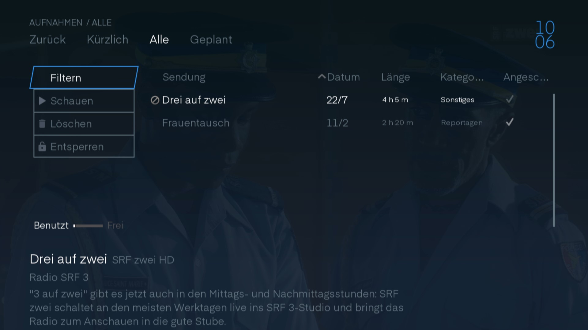

# Aufnahmen

In den Aufnahmen finden Sie alle Sendungen, die Sie zur Aufnahme markiert hatten.

Neben der Schaltfläche `Zurück` finden Sie verschiedene Filter, die Ihnen helfen, die Aufnahme zu finden.

## Kürzlich

Im Aufnahmefenster finden Sie die kürzlich aufgenommenen Sendungen wieder.

Sie erhalten einen kurzen Beschrieb der Sendung. Wählen Sie die Sendung aus, gelangen Sie zur [Sendungsinfo](../senderinformation/#infomenu "Sendungsinfo").

 

## Alle

Hier finden Sie alle Sendungen, die aufgenommen wurden.

Ein kurzer Beschrieb gibt Ihnen Auskunft über den Inhalt der Sendung. Wenn Sie die Sendung auswählen, gelangen Sie zur [Sendungsinfo](../senderinformation/#infomenu "Sendungsinfo"). Hier erhalten Sie zudem die Information über den Speicherplatz, welcher für die Aufnahmen verwendet wurde und wie viel Speicherplatz Ihnen noch zur Verfügung steht.

 

In der Liste der Aufnahmen können Sie durch die Spalten gehen. Wenn Sie auf der Spalte   drücken können Sie die Aufnahmeliste sortieren.

Wenn Sie eine Aufnahme auswählen kommen sie in die [Sendungsinfo](../senderinformation/#infomenu "Sendungsinfo").

Links neben der Liste sind Bedienelemente.

### Filter

Wenn man auf `Filter` klickt erscheint ein Fenster mit allen Kategorien, die bei Ihren Aufnahmen verfügbar sind. Wählen Sie einen Filter aus und sie Sehen nur noch die Aufnahmen mit der ausgewählten Kategorie.

 

### Schauen

Wenn Sie auf `Schauen` gehen beginnt die Aufnahme direkt vom Anfang.

### Löschen

Mit `Löschen` können Sie die Aufnahme aus ihrer Bibliothek entfernen und somit Speicherplatz freigeben. Achtung es gibt kein Bestätigungsfenster.

### Sperren

Wenn Sie nicht möchten das jemand anderes Iher Aufnahme anschaut oder löscht, können Sie die Aufnahme sperren. Nun ist es nur noch mit dem `Master PIN` möglich die Aufnahme zu löschen oder anzusehen.

## Geplant

Hier finden Sie alle Sendungen, die in Zukunft aufgenommen werden.

 

In der Liste der Aufnahmen können Sie durch die Spalten Scrollen. Wenn Sie auf der Spalte   drücken, können Sie die Aufnahmeliste sortieren.

Wählen Sie eine Aufnahme aus, erscheint die [Sendungsinfo](../senderinformation/#infomenu "Sendungsinfo").

Links neben der Liste befinden sich die Bedienelemente.

### Filter

Klicken Sie die Schaltfläche `Filter`, erscheint ein Fenster mit allen Kategorien, unter welchen die aufgenommenen Sendungen abgespeichert sind.. Wählen Sie einen Filter aus und Sie sehen nur noch die Aufnahmen mit der ausgewählten Kategorie.

 

### Löschen

Mit `Löschen` können Sie die Aufnahme aus ihrer Bibliothek entfernen und so wieder Speicherplatz freigeben. Achtung es gibt kein Bestätigungsfenster.

### Sperren

Sperren Sie Ihre Aufnahmen, wenn die Aufnahmen nicht von Zweitpersonen angeschaut oder gelöscht werden sollen. Ab diesem Moment kann die Aufnahme nur noch mit der Eingabe des `Master PIN` angeschaut oder gelöscht werden.