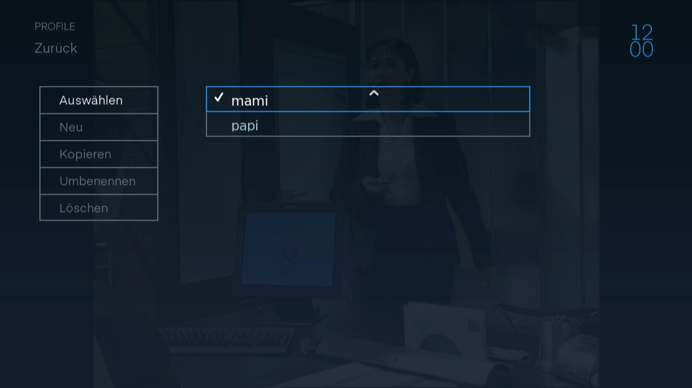
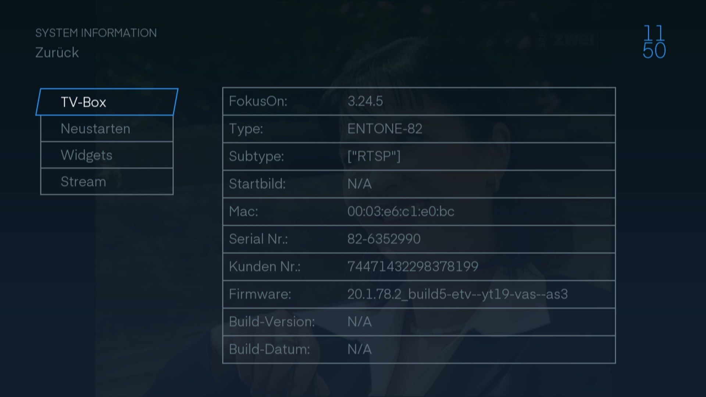
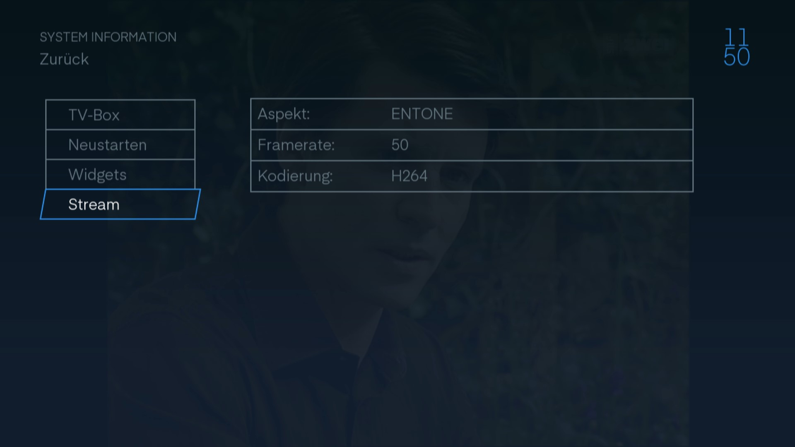
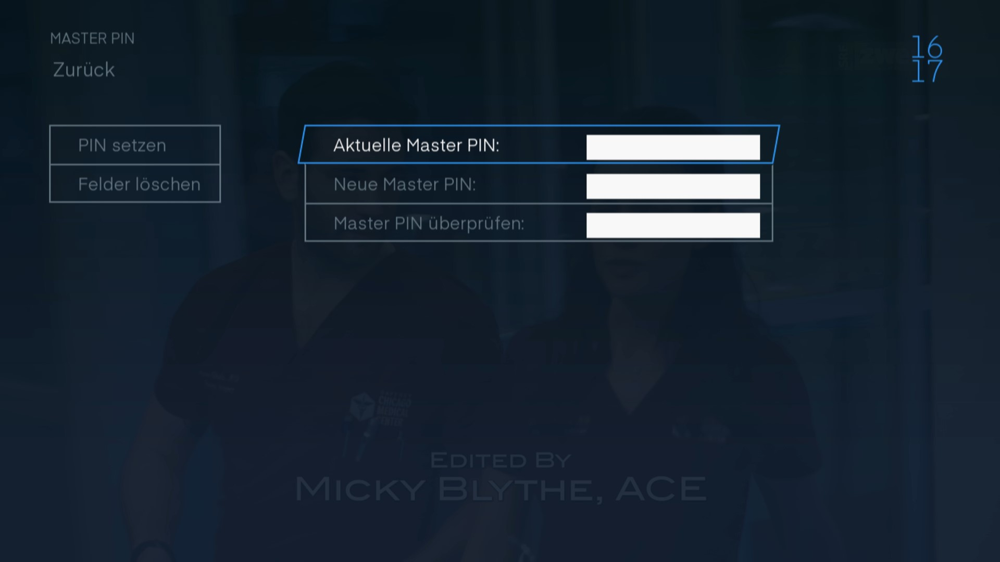

# Einstellungen

Passen Sie Ihr Produkt nach ihren Wünschen und Bedürfnissen an.

## Favoriten

Sie möchten Ihre eigene Senderliste? So wird eine erstellt:

Klicken Sie die Schaltfläche `Favoriten`. Nun können Sie in der Liste der Sender mit der Schaltfläche `OK`, Sender hinzufügen. In der Liste der Favoriten können Sie per `OK` Taste und den Pfeiltasten die Reihenfolge ändern oder den Sender aus der Liste entfernen. Mit `Favoriten [NR] aktivieren` können Sie Ihre Liste auswählen. Um auf die Standard Senderliste zu gelangen, können Sie die Liste am gleichen Ort deaktivieren.

## Profile

Mit der Schaltfläche `Profil` haben Sie die Möglichkeit, verschiedene Profile zu erstellen, je nach Bedürfnis. In den Profilen können die Einstellungen in den Schaltflächen `Audio und Video` und in den `Favoriten` unterschieden werden.

Die Schaltflächen auf der linken Seite hilft Ihnen, diese Einstellungen vorzunehmen. Mit der Tastatur auf der Fernbedienung lassen sich die Profile auf einfache Weise benennen.

## Audio & Video

### Menü Sprache

In welcher Sprache soll die Oberfläche sein?

### Audiosprache

Es gibt Sender, die Sendungen in mehreren Sprachen übertragen. Definieren Sie Ihre bevorzugte Sprache. Die Audiosprache lässt sich von Sender zu Sender einstellen. Weitere Informationen dazu finden Sie [hier](../senderinformation/#sprache).

### Untertitel

Untertitel lassen sich standardmässig einschalten. Stellen Sender Untertitel zur Verfügung, wird eine entsprechende Notiz angezeigt. Stellt ein Sender mehrsprachige Untertitel zur Verfügung, werden die Untertitel in der Sprache angezeigt, die Sie definiert haben. Die Untertitel lassen sich von Sender zu Sender einstellen. Weitere Informationen dazu finden Sie [hier](../senderinformation/#sprache).

### Info Time-out

Sie entscheiden wie lange der Infobanner zu sehen ist, bis er automatisch ausgeblendet wird.

### Guide Zeitspanne

Entscheiden Sie welche Zeitspanne im Guide angezeigt werden soll. Wählen Sie 3 Stunden, ist der Zeitplan von 3h ersichtlich. Wenn Sie im Guide scrollen, springen Sie in den hier definierten Schritten.

### Mein TV

Stellen Sie hier das passende TV-Format ein.

### 4:3 Format oder 16:9 Format

Hier können Sie einstellen was mit den Fernsehbildern des jeweils anderen Formates geschehen soll. Soll das Bild schwarze Balken haben, verzogen werden oder an den Ränder abgeschnitten. Im Hintergrund können Sie sehen wie es danach aussehen wird.

### Auto-Sperrung

Die Admin-Berechtigung dauert nur eine gewisse Zeit. Hier können Sie die Frist der Admin-Berechtigung einstellen.

### Name des Gerätes

Geben Sie Ihrer Box einen Namen aus der vordefinierten Liste.

### Standby

Definieren Sie, nach welcher Zeit Ihr Gerät, ohne Interaktion, automatisch in den Standby-Modus schaltet.

## System Information

In den System Informationen erhalten Sie Informationen über Ihrr TV-Box.

### TV-Box

Unter TV-Box finden Sie verschiedene Informationen über die TV-Box und die eingesetzte Software. Ebenfalls finden Sie die Serialnummer und die MAC-Adresse, die für den Support wichtig sind.

### Neustart

Um die Software neu zu laden, klicken Sie die Schaltfläche `Portal neu laden`.

Klicken Sie die Schaltgläche `TV-Box neu starten` wird die ganze TV-Box neu gestartet. Oder nehmen Sie die TV-Box vom Strom. Dies kann helfen bei gröberen Fehlern.

### Widgets

Unter Widgets finden Sie Informationen zur eingesetzten Software und Version.

### Stream

Hier können Sie sehen, welche Kodierung verwendet wird und welche Framerate.

## Systementsperrung

Diese Taste gibt Ihnen während 15 Minuten Admin-Berechtigungen. Diese Berechtigung benötigen Sie, um die folgenden Einstellungen zu verwalten.

Falls Sie mit Ihren Einstellungen vor dem Ablauf der Zeit zufrieden sind, können Sie die Berechtigung auch manuell wieder aufheben, in dem Sie auf die gleiche Taste klicken.

## Altersfreigabe

Die Altersfreigabe sperrt alle Sendungen, die an eine Altersbegrenzung gekoppelt sind. Diese Informationen werden vom Sender bereitgestellt.

Um diese Eingaben zu tätigen, benötigen Sie den `Master PIN`. Der Master PIN wird von Ihrem Anbieter bereitgestellt.

## Sendersperrung

Mit der Schaltfläche `Sendersperrung`stellen Sie sicher, dass einzelne Sender gesperrt werden.

Nutzen Sie dazu den `Master PIN`. Wählen Sie den gewünschten Sender aus und bestätigen Sie mit der `OK` Taste die Sperrung, respektive die Entsperrung eines Senders.

## Master PIN

Mit dem Master PIN sichern Sie sich ab vor nicht autorisierter Bedienung oder zur Einschränkung von Funktionen.

Dieser PIN ist gleich zu werten wie das Admin Passwort Ihrer TV-Box. Auf dieser Seite ändern Sie den PIN bei Bedarf.

 

## Pairing-PIN

Sie möchten unterwegs Fernsehen oder bei Ihnen zuhause während dem Kochen fernsehen. Dann laden Sie die TV-App herunter oder öffnen Sie das Web-TV. Unter der Anleitung finden Sie für was Sie den Pairing-PIN brauchen.

[Anleitung App und Web-TV](../../mobile "Mobile-TV")

