# TV

Hier finden Sie die Dokumentation zu ihrem TV.

## Start

Wenn Sie die TV-Box über den 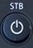 Knopf über dem STB steht anschalten, finden Sie sich Live in einer Sendung wieder.

## Fernbedienung

### Einschalttasten

Oben an der Fernbedienung finden Sie die Einschaltknöpfe.

Bei der, wo `TV/Aux` steht, kann der Fernseher in den Standbymodus geschaltet werden. Bei der Taste mit `STB` darüber wird nur die Set-Top-Box in den Standbymodus versetzt.

### Farbnavigatiostasten

Wenn Sie über die 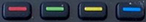 Taste in den Teletext gelangen, können sie mit den Farbigen tasten durch den Teletext navigieren.

### Skip und Replay

Unter den Farbnavigationstasten finden Sie rechts und links die 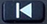 und  Tasten, mit denen man eine Sendung überspringen oder zurückspringen kann.

In der Mitte der beiden Tasten findet sich die 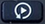 Taste. Mit dieser kommt man in die Replay Bibliothek.

### Navigationstasten und Aufnahme

Mit den Tasten  und  kann man vor und zurückspulen. Wenn man die Tasten mehrmals drückt, wird der Spulvorgang beschleunigt.

Mit dem  Knopf in der Mitte pausiert und startet das Programm.

Die Taste  bringt Sie im Replay wieder zurück zum Liveprogram und bei Aufnahmen beenden sie diese.

Mit der  Taste kann man einstellen, dass die Sendung aufgenommen wird.

#### Aufnehmen

Wenn Sie während einer Aufnahme noch mal auf die  Taste klicken, erscheinen die Aufnahmeeinstellungen.

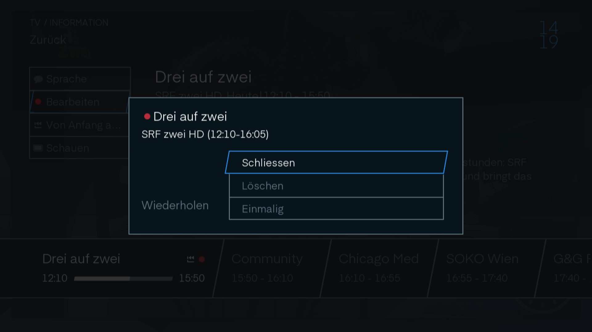 {: loading=lazy }

Mit `Schliessen` schliessen Sie das Aufnahme Fenster wieder.

Mit `Löschen` beenden Sie die Aufnahme und das bisher 
Aufgenommene wird gelöscht.

Unter `Wiederholen` können Sie einstellen ob sie nur diese Sendung aufnehmen wollen oder ob jede Sendung der Serie in Zukunft aufgenommen werden soll.

### Navigationsknöpfe

Mit der  Taste kommen Sie ins Menu.

Mit der 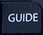 Taste kommen Sie in den Guide.

Mit der 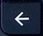 Taste können sie zurück von wo sie gerade gekommen sind.

Bei der  Taste wird der Programmbanner angezeigt.

Brauchen Sie die Pfeiltasten um in den Menus zu navigieren. Um etwas auszuwählen, klicken sie mit  {: loading=lazy }.

### Lautstärke und Zapptasten

Mit den Tasten 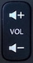 können Sie die Lautstärke einstellen. Wenn sie den TV Stumm schalten wollen klicken sie auf 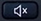 {: loading=lazy }. Wenn der Fernseher Stumm geschaltet ist kann man ihn wieder laut schalte indem man entweder auf die  Taste klickt oder lauter und leiser stellt.

Die Tasten 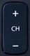 ermöglichen das Zappen hoch und runter in der Programmliste.

Die  Taste wird für die Sprachsteuerung gebraucht. (Ist leider noch nicht möglich) 

### Kanalauswahl und Texteingabe

Mit diesen Tasten kann man direkt zum Sender mit der entsprechenden Nummer in der Programmliste springen.

### Spezialtasten

Mit der 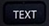 Taste kommt man in den Teletext.

Bei 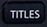 kann man die Sprache der Sendung und die Untertitel einstellen.

Die 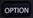 Taste bringt Sie in die Einstellungen.

Mit der  Taste kommen sie zum Radio. Und vom Radio wieder zurück ins TV.