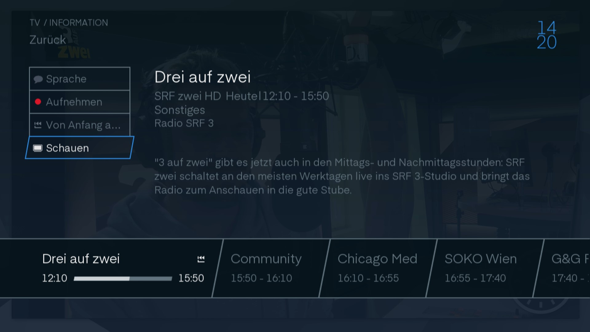
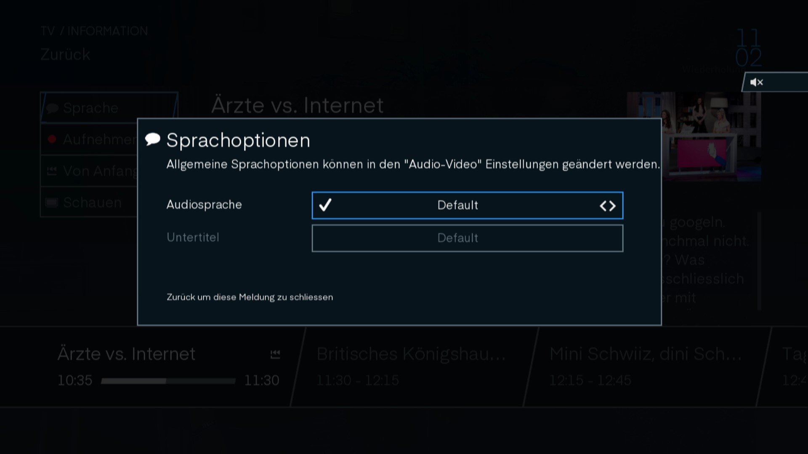

# TV Oberfläche

Wenn Sie ihren Tv normal anschalten Sehen Sie normalerweise den Sender der Sie zuletzt geschaut haben.

## Infobanner

Wenn Sie auf  klicken können Sie den akutellen Sender sehen mit der Nummer in ihrer Senderliste. Ebenfalls sehen Sie welchse Programm gerade läuft und was folgt.

Mit den Rechts und Links Tasten können Sie im Programm des Senders wechseln.

Mit den Rauf und Runter Tasten können sie den Sender nach Ihrer Programmliste wechseln.

Wenn sie nochmal  drücken kommmen Sie in die Info.

## Info

Mit dem Knopf  auf der Fehrnbienung kommen Sie auf die Programm Info. Hier können sie die Informationen der Sendung sehen.

### Infomenu

Auf der Linken Seite finden Sie 4 Knöpfe:

#### Sprache

Wenn sie mit den Pfeiltasten auf `Sprache` navigieren und Ok klicken, kommen sie auf die Spracheinstellung des Senders.

> In dieses Menu kommt man auch mit der `Titles` Taste auf der Fernbedienung.

Hier können Sie die Audiosprache und der Untertitel einstellen. Die verfügbaren Sprachen sind vom Sender abhängig.

> Allgemeine Sprachoptionen können in den "Audio-Video" Einstellungen geändert werden.

#### Aufnahme

Wenn Sie über `Aufnahme` OK klicken wird die Sendung aufgenommen und ist somit am Ende der Sendung verfügbar in Ihren Aufnamen. 

> Dies funktioniert auch mit dem  Knopf auf der Fernbedienung.

Wenn stattdessen `Bearbeiten` steht kann man mit OK draufklicken. Nun erscheint ein Fenster mit verscheidenen Optionen.

> In dieses Menu kommt man auch mit dem  Knopf auf der Fernbedienung.

Mit `Schliessen` kann man das Fenster wieder schliessen.

Mit `Löschen` unterbricht man die Aufnahme und das bereitsaufgenommene wird gelöscht.

Unter `Wiederholden` kann man mit den Navigationstasten einstellen ob nur diese Sendung oder die ganze Serie der Sendungen aufgenommen werden soll. Sozusagen ein Serien Aufnahme Abo.

#### Von Anfang an schauen

Mit dieser Schaltfläche kann man per OK an den Anfang der Sendung springen.

#### Schauen 

Entweder man klickt auf die `Schauen` Schaltfläche oder nach einer bestimmten Zeit wirde die Info ausgeblendet.

### Sendungsbeschrieb

Oben angefangen mit dem Namen der Sendung. Danach der Sender mit der Start und Endzeit der Sendung. Darungter die Kategorie. Der Lange Text ist der Beschrieb der Sendung. Wenn `Verfügbar mit Replay` zu unterst steht kann man die Sendung zurückspulen.

### Senderbalken

Auf dem Senderbalken kann man sehen welche Sendung im moment läuft und welche Sendungen zu welcher Zeit folgen.

> Dieser Balken kann auch eingeblendet werden, wenn man auf `OK` Taste klickt. Klickt man nochmal `OK` dann kommt man in die Programm Info.

## Home

Wenn Sie auf der Fernbedienung  drücken kommen Sie auf den Homebildschirm. Von hier können sie in die Verschiedenen Fatures gehen.

