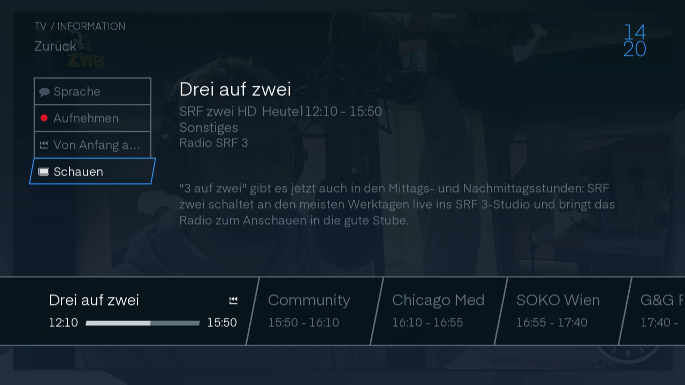
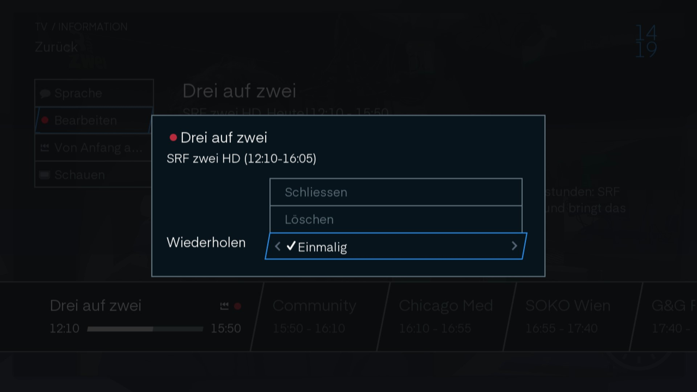
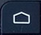
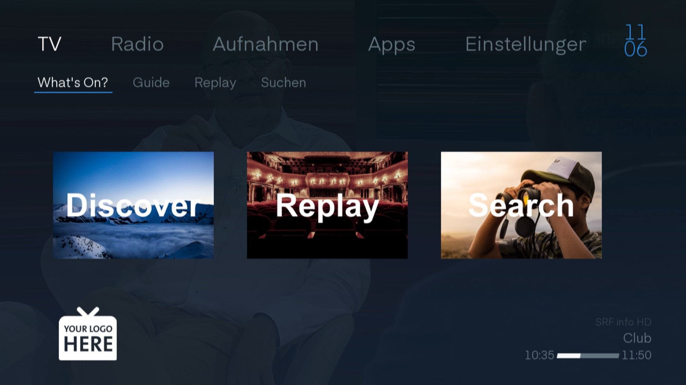

# TV Oberfläche

Wenn Sie ihren TV einschalten, sehen Sie normalerweise den Sender, den Sie zuletzt geschaut haben.

## Infobanner

Wenn Sie auf  klicken, können Sie den aktuellen Sender sehen. Ebenfalls sehen Sie, welche Sendung gerade läuft und was danach folgt.

Mit den rechts und links Tasten können Sie im Programm des Senders wechseln.

Mit den rauf und runter Tasten können sie den Sender wechseln.

Wenn sie noch mal  drücken kommen Sie in die Sendungsinfo.

## Sendungsinfo

Mit dem  Knopf auf der Fernbedienung kommen Sie in die Sendungsinfo. Hier können sie die Informationen zur Sendung sehen.

### Infomenu

Auf der linken Seite in der Sendungsinfo finden Sie vier Knöpfe:

#### Sprache

Wenn sie mit den Pfeiltasten auf `Sprache` navigieren und `Ok` klicken, kommen Sie auf die Spracheinstellung des Senders.

> In dieses Menu kommt man auch mit der `Titles` Taste auf der Fernbedienung.

Hier können Sie die Audiosprache und der Untertitel einstellen. Die verfügbaren Sprachen sind vom Sender abhängig.

> Allgemeine Sprachoptionen können in den ["Audio-Video" Einstellungen](../einstellungen/#audio-video) geändert werden.

#### Aufnahme

Wenn Sie über `Aufnahme` OK klicken, wird die Sendung aufgenommen und ist somit am Ende der Sendung verfügbar in Ihren Aufnahmen. 

> Dies funktioniert auch mit dem  Knopf auf der Fernbedienung.

Falls dort `Bearbeiten` steht, kann man mit OK draufklicken. Nun erscheint ein Fenster mit verschiedenen Optionen.

> In dieses Menu kommt man auch mit dem  Knopf auf der Fernbedienung.

Mit `Schliessen` kann man das Fenster wieder schliessen.

Mit `Löschen` unterbricht man die Aufnahme und das bereits Aufgenommene wird gelöscht.

Unter `Wiederholen` kann man mit den Navigationstasten einstellen, ob nur diese Sendung oder die ganze Serie aufgenommen werden soll.

#### Von Anfang an schauen

Mit dieser Schaltfläche kann man per OK an den Anfang der Sendung springen.

#### Schauen 

Entweder man klickt auf die `Schauen` Schaltfläche oder nach einer bestimmten Zeit wird die Info ausgeblendet.

### Sendungsbeschrieb

Oben angefangen mit dem Namen der Sendung. Danach der Sender mit der Start- und Endzeit der Sendung. Darunter die Kategorie. Der lange Text ist der Beschrieb der Sendung. Wenn `Verfügbar mit Replay` zuunterst steht, kann man die Sendung zurückspulen.

### Senderbalken

Auf dem Senderbalken kann man sehen, welche Sendung im Moment läuft und welche Sendungen folgen.

> Dieser Balken kann auch eingeblendet werden, wenn man auf die `OK` Taste drückt. Drückt man nochmal `OK`, dann kommt man in die Sendungsinfo.

## Home

Wenn Sie auf der Fernbedienung  drücken, kommen Sie auf den Homebildschirm. Von hier können sie in die verschiedenen Funktionen gehen.

