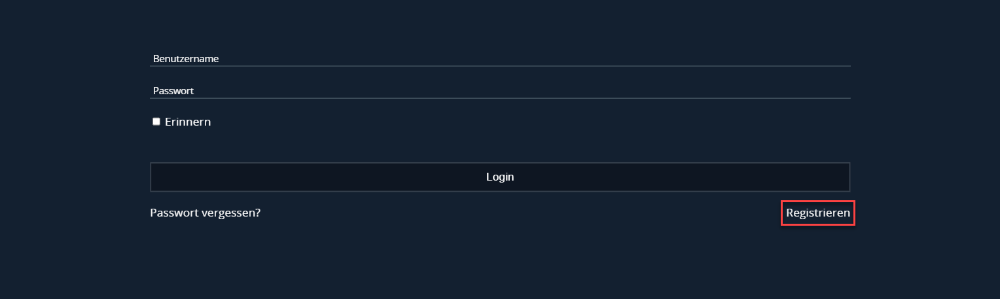
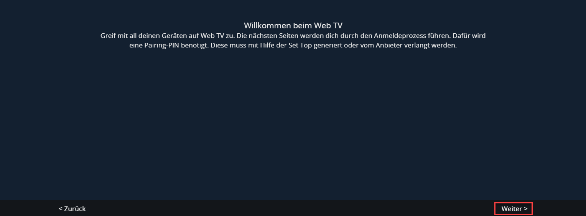
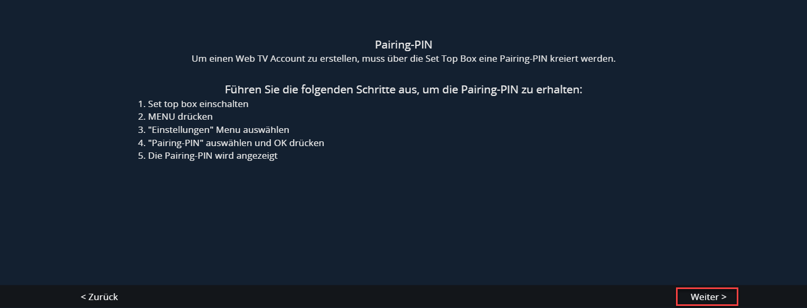
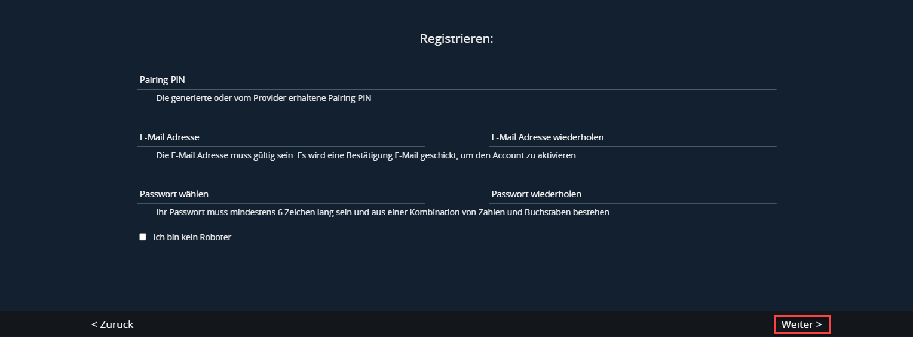
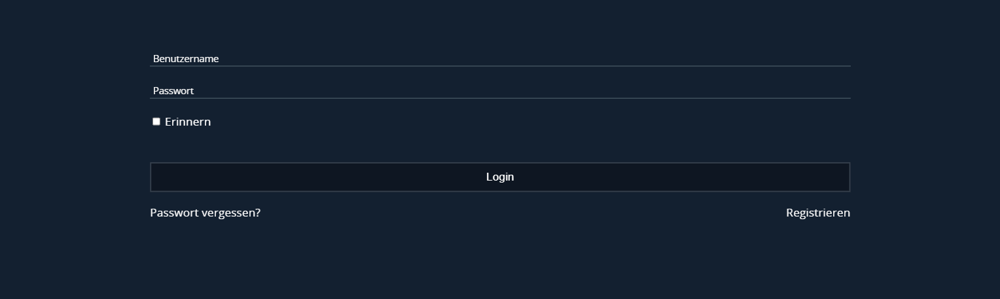
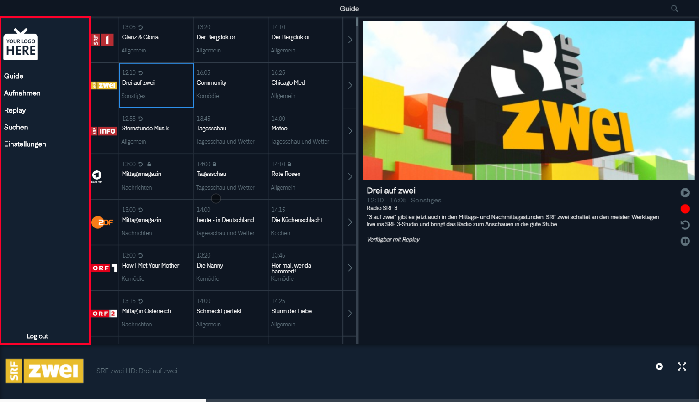
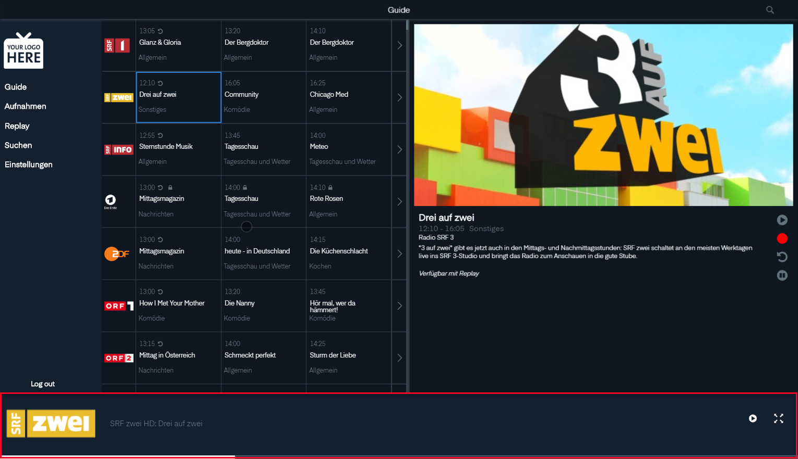
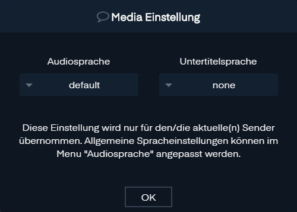
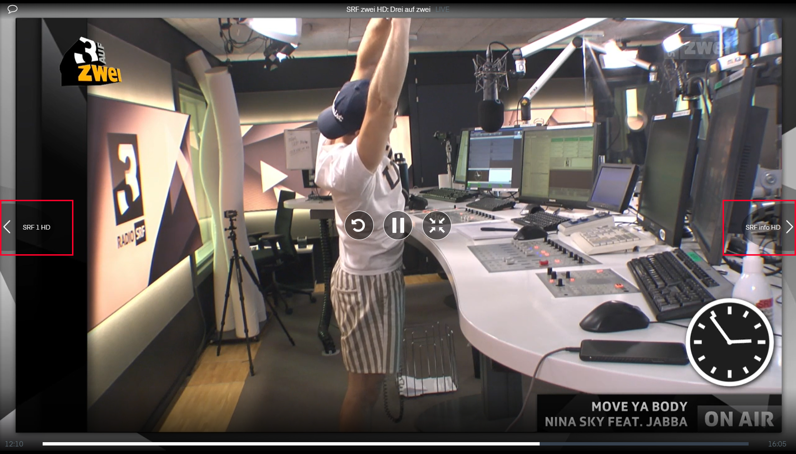
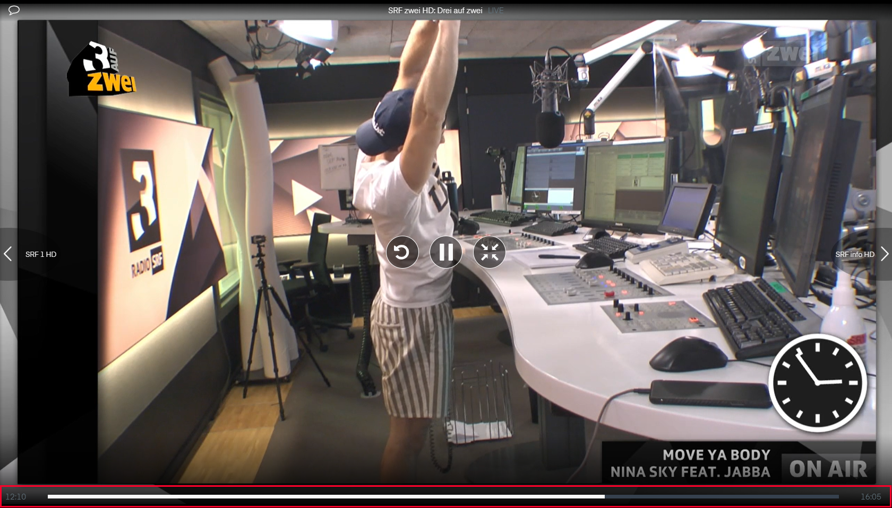

# Webportal

Sie können Ihr Programm auch auf ihrem PC oder Laptop schauen.

## Erste Schritte

### Regristrieren

    Leider noch nicht fertig

Bei Login Fenster gehen sie auf `Regristrieren`.

Klicken Sie auf `Weiter`.

Um einen Web TV Account zu erstellen, muss über die Set Top Box eine Pairing-PIN kreiert werden.

1. Set top box einschalten
2. MENU drücken
3. "Einstellungen" Menu auswählen
4. "Pairing-PIN" auswählen und OK drücken
5. Die Pairing-PIN wird angezeigt

Klicken Sie auf `Weiter`.

Füllen Sie den Pairing Code ein und füllen Sie den Rest des Folmulares aus.

Bestätigen Sie Ihre Angaben mit `Weiter`.

### Login

Füllen Sie das Loginformular aus.

Wenn sie möchten dass Sie beim nächsten mal sich nicht einloggen müssen klicken sie auf `Errinern`.

Kicken Sie nun auf `Login`.

## Grundlegende Benutzeroberfläche

### Navigation

Von der Navigation kommt man in die gewünschte Ansicht.

Zu unterst kann man sich wieder Ausloggen.

### Playerbar

Auf der Playerbar kann man sehen welcher Sender man ausgewählt hat und was gerade läuft.

Auf der rechten Seite findet man die Buttons  und .

Der Button  Startet das Ausgewählte. Nun erschein ein ander Knopf  mit dem man den Stream wieder abstellen kann.

Wenn man auf den Button , auf die Vorschau oder das Logo des Senders klickt kommt man auf zum Player.

Unter der Playerbar ist ein Zeitsrahl der Anzeigt wie lange die Sendung schon geht und wie lange das diese noch gehen wird.

## Player

Wenn man auf die Grossansicht klickt erscheint die Benutzeroberfläche. Oben in der Mitta kann man den Sender und das Programm sehen.

### Media Einstellung

Wenn man beim Player oben Links auf die Sprechblasse  klickt erscheint die Media Einstellung.

Hier kann man die Audiosprache einstellen und die Untertitel.

> Diese Einstellung wird nur für den/die aktuelle(n) Sender übernommen. Allgemeine Spracheinstellungen können im Menu "Audiosprache" angepasst werden.

Die Einstellungen werden mit `OK` übernomen.

### Playersteuerung

In der Mitte gibt es 3 Knöpfe.

 Kann man zum Anfang der Sendung springen.

 Kann mann das Programm pausieren.

 Kommt man ins Menü.

Wenn die Sendung im Replay ist oder pausiert kann man mit dem  Knopf auf Live springen.

Wenn Pausiert ist kann man mit  wieder weiterschauen.

### Zappen

Links und Reckts zum Bild wird der vordere und hintere Sender der Sendeliste angezeigt. Wenn man drauf klickt kommt man zum Sender.

### Zeitstrahl

Auf dem Zeitstrahl kann man sehen wie lange das die Sendung geht und kann per Klick zu einer vorgehenden Stelle wechseln.

