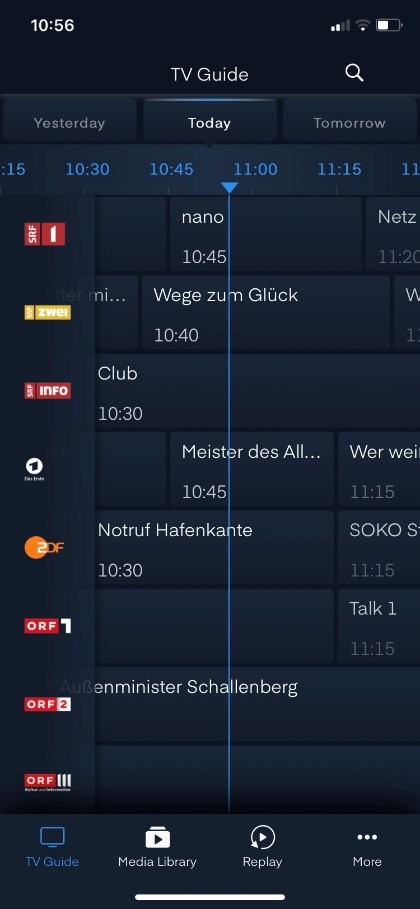

# TV App für mobile Devices

Der Menütitel  zeigt jederzeit an, in welchem Menü man sich befindet.

Die Navigation in der App wird mit dem Menübalken unten gemacht.

Es stehen 4 Möglichkeiten zur Auswahl:

- Guide
- Aufnahmen
- Replay
- Mehr