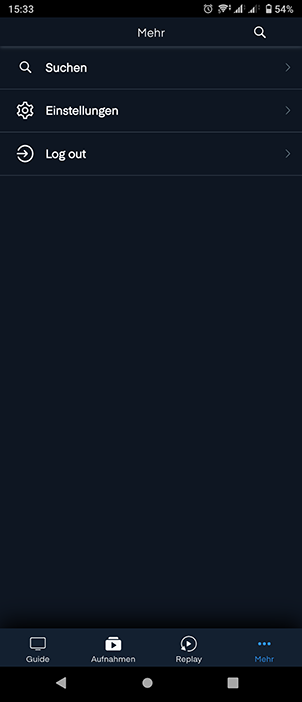
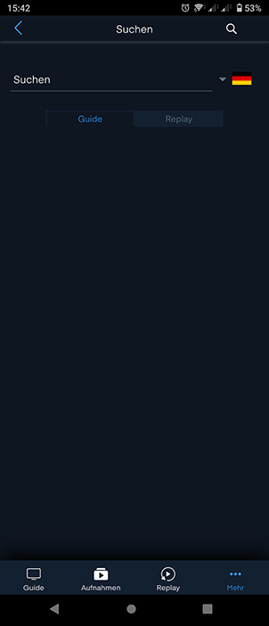
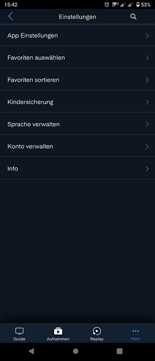
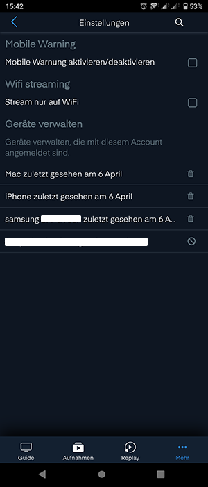
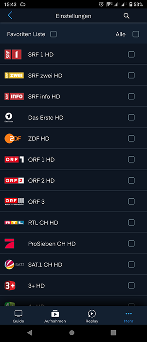
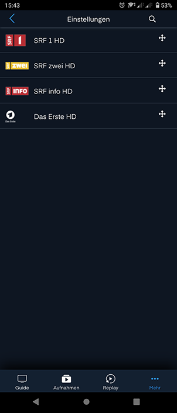
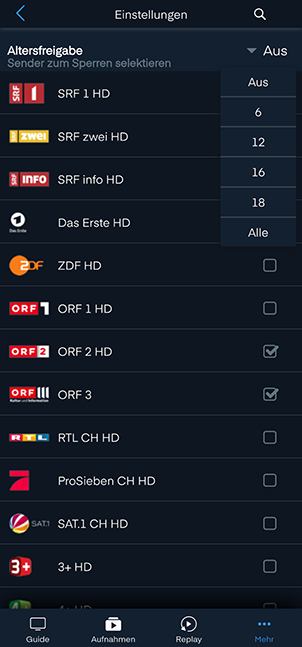
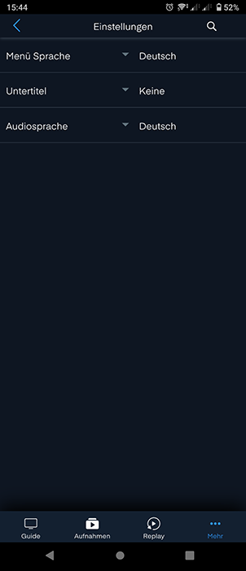
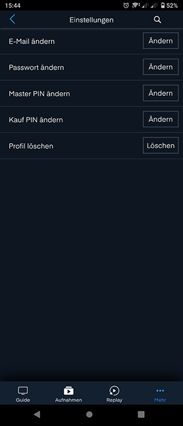
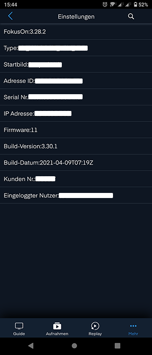

# Mehr

## Suchen

Mit der Eingabe eines Suchwortes kann nach einem spezifischen Content gesucht werden. Einerseits kann die Sprache ausgewählt und andererseits zwischen folgenden zwei Kategorien gewählt werden: 

### Guide

Ist «Guide» als Suchfilter angewählt, wird das ganze Programm nach dem Suchwort durchsucht. Dies beinhaltet einerseits bereits ausgestrahlte Sendungen, andererseits zeigt es auch Sendungen in der Zukunft an. Um zukünftige Sendungen nicht zu verpassen, kann ein Reminder gesetzt oder ein Aufnahmeplan erstellt werden.

### Replay

Ist «Replay» als Suchfilter angewählt, werden nur verpasste Sendungen angezeigt, welche bereits ausgestrahlt wurden und bei entsprechendem Abo mit Replay angeschaut werden können. Falls Sie diese Sendung später anschauen möchten, kann sie aufgenommen werden.

## Einstellungen

### App-Einstellung

In der App-Einstellung können Sie eine «Mobile Warnung» aktivieren respektive deaktivieren. Befinden Sie sich nicht im Wifi-Netzwerk, wird Ihnen eine Warnung angezeigt, dass Kosten für das Datenvolumen, sofern nicht inklusive, bei Ihrem Provider anfallen können.

Mit der Option «Wifi Streaming» wird das Streaming über die mobilen Daten unterbunden.

Unter «Geräte verwalten» sehen Sie die Geräte, auf welchen Sie mit Ihrem Account angemeldet sind. Bitte löschen Sie nicht mehr verwendete Geräte aus dieser Liste. Das zurzeit verwendete Gerät kann nicht gelöscht werden. 

### Favoriten auswählen

Wählen Sie alle Kanäle aus, welche zu Ihrer Mobile-Favoritenliste gehören sollen. Die Favoritenliste auf Ihrem Mobile Phone oder Ihrem PC entspricht nicht der Senderliste auf Ihrer Set-Top-Box und kann daher separat erstellt werden. Achtung, neue Kanäle müssen jeweils der Favoritenliste hinzugefügt werden. Die Favoritenliste wird durch das Anwählen des Felds «Favoritenliste» aktiviert. 

### Favoriten sortieren

Wurde die Favoritenliste unter «Favoriten auswählen» aktiviert, können kann die Reihenfolge der Kanäle in diesem Menü angepasst werden. Bitte halten Sie dazu das Doppelpfeil-Symbol gedrückt und verschieben Sie durch eine Aufwärts-respektive Abwärtsbewegung den Sender an die gewünschte Stelle.

### Kindersicherung

Durch die Eingabe der Master-PIN kann die Kindersicherung konfiguriert werden. Wird ein Kanal angewählt, kann dieser nur mit Eingabe der PIN abgespielt werden. Möchten Sie nicht komplette Kanäle sperren, sondern nur Filme, welche eine bestimmte Alterslimite überschreiten, kann die entsprechende Alterslimite im Dropdown ausgewählt werden. Die korrekte Auswahl der richtigen Altersbegrenzung wird durch den TV-Sender vorgenommen und kann daher fehlerhaft sein. 

### Sprache verwalten

Im Menü «Sprache verwalten» können folgende drei Sprachen geändert werden:

- Menüsprache: Die Sprache des Menüs kann geändert werden.
- Untertitelsprache: Eine Default-Untertitelsprache kann ausgewählt werden. Besitzt die aktuell gesendete Sendung Untertitel in der ausgewählten Sprache, werden diese angezeigt. Diese Einstellung kann durch Klicken der Sprechblase im Vollbildmodus unter «Media-Einstellung» für die geschaute Sendung übersteuert werden.
- Audiosprache: Eine Default-Audiosprache kann ausgewählt werden. Besitzt die aktuell gesendete Sendung eine Tonspur in der ausgewählten Sprache, wird diese verwendet. Diese Einstellung kann durch Klicken der Sprechblase im Vollbildmodus unter «Media-Einstellung» für die geschaute Sendung übersteuert werden.

### Konto Verwalten

Unter «Konto verwalten» kann die E-Mail-Adresse des verwendeten Kontos oder dessen Passwort geändert werden. Des Weiteren kann die Master-respektive die Kauf-PIN geändert werden. Benötigen Sie Ihr Konto nicht mehr, kann dies über «Profile löschen» gelöscht werden. Sie werden danach automatisch ausgeloggt und können das Konto nicht mehr verwenden.

### Info

Unter «Info» werden Ihnen Informationen angezeigt, die Ihrem Kundenberater bei einem Supportfall weiterhelfen können.

## Logout

Hier können Sie sich ausloggen.