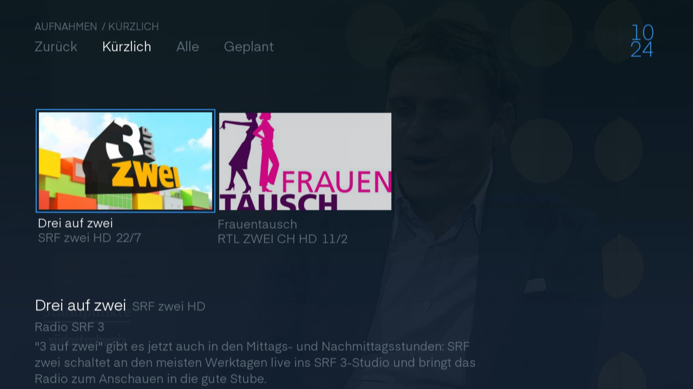
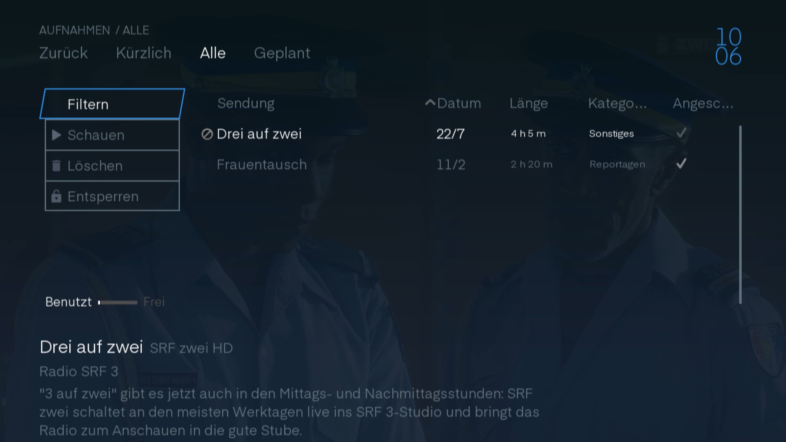
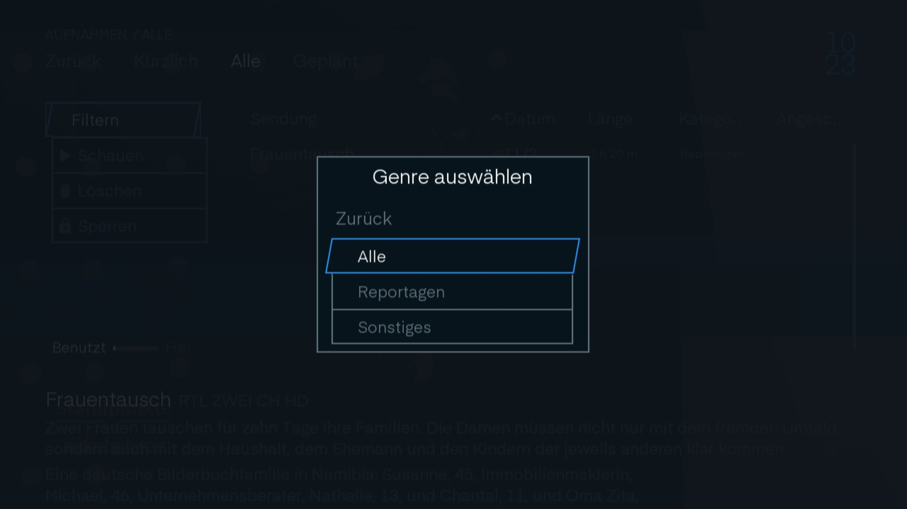
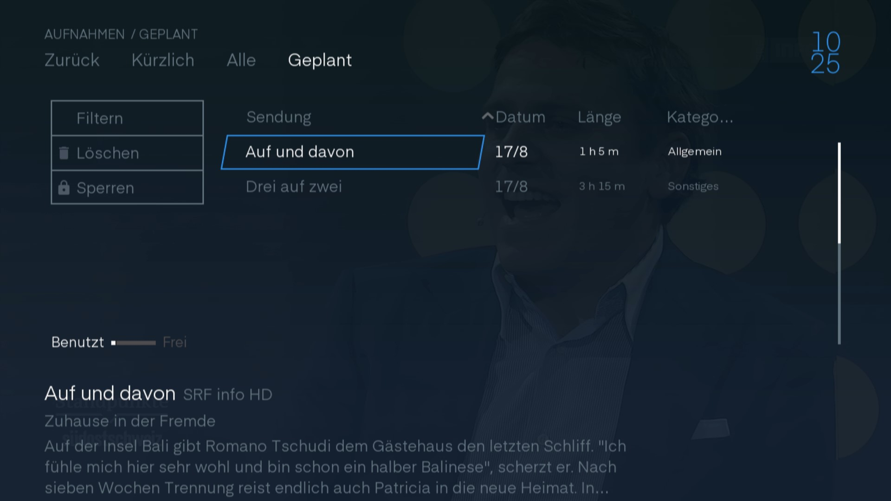

# Aufnahmen

In den Aufnahmen finden Sie alle Sendungen die Sie zur Aufnahme markiert haben.

Oben neben dem Zurück sind verschiedene Filter, die Ihnen helfen die Aufnahme zu finden.

## Kürzlich

Wenn sie ins Aufnahmefenster kommen finden Sie sich gerade bei den kürzlich aufgenommenen Sendungen wieder. Hier können Sie Sendungen finden, die zuletzt gelaufen sind und aufgenommen worden sind.

Unten finden Sie ein kleiner Beschrieb der Sendung. Wenn Sie die Sendung auswählen kommen Sie zur [Sendungsinfo](../senderinformation/#infomenu "Sendungsinfo").

 

## Alle

Hier finden Sie alle Sendungen die aufgenommen wurden.

Unten finden Sie ein kleiner Beschrieb der Sendung. Wenn Sie die Sendung auswählen kommen Sie zur [Sendungsinfo](../senderinformation/#infomenu "Sendungsinfo"). Gerade oberhalb des Sendungsbeschriebs können Sie sehen wie viel Speicherplatz ihre Aufgenommenen Sendungen belegen und wie viel, dass Sie noch belegen können.

 

In der Liste der Aufnahmen können Sie durch die Spalten gehen. Wenn Sie auf der Spalte   drücken können Sie die Aufnahmeliste sortieren.

Wenn Sie eine Aufnahme auswählen kommen sie in die [Sendungsinfo](../senderinformation/#infomenu "Sendungsinfo").

Links neben der Liste sind Bedienelemente.

### Filter

Wenn mann auf `Filter` klickt erscheint ein Fenster mit allen Kategorien die bei Ihren Aufnahmen verfügbar sind. Wählen Sie einen Filter aus und sie Sehen nur noch die Aufnahmen mit der ausgewählten Kategorie.

 

### Schauen

Wenn Sie auf `Schauen` gehen beginnt die Aufnahme direkt vom Anfang.

### Löschen

Mit `Löschen` können Sie die Aufnahme aus ihrer Bibliotek entfernen und so mit Speicherplatz freigeben. Achtung es gibt kein Bestätigungsfenster.

### Sperren

Wenn Sie nicht möchten das jemand anderes Iher Aufnahme anschaut oder löscht, können Sie die Aufnahme sperren. Nun ist es nur noch mit dem `Master PIN` möglich die Aufnahme zu löschen oder anzusehen.

## Geplant

Hier finden Sie alle Sendungen die in Zukunft aufgenommen werden.

 

In der Liste der Aufnahmen können Sie durch die Spalten gehen. Wenn Sie auf der Spalte   drücken können Sie die Aufnahmeliste sortieren.

Wenn Sie eine Aufnahme auswählen kommen sie in die [Sendungsinfo](../senderinformation/#infomenu "Sendungsinfo").

Links neben der Liste sind Bedienelemente.

### Filter

Wenn mann auf `Filter` klickt erscheint ein Fenster mit allen Kategorien die bei Ihren Aufnahmen verfügbar sind. Wählen Sie einen Filter aus und sie Sehen nur noch die Aufnahmen mit der ausgewählten Kategorie.

 

### Löschen

Mit `Löschen` können Sie die Aufnahme aus ihrer Bibliotek entfernen und so mit Speicherplatz freigeben. Achtung es gibt kein Bestätigungsfenster.

### Sperren

Wenn Sie nicht möchten das jemand anderes Iher Aufnahme anschaut oder löscht, können Sie die Aufnahme sperren. Nun ist es nur noch mit dem `Master PIN` möglich die Aufnahme zu löschen oder anzusehen.