# Einstellungen

Passen Sie Ihr Produkt nach ihren Wünschen und Möglichkeiten an.

## Favoriten

Sie möchen eine eigene Senderliste. Hier können Sie eine erstellen.

Gehen Sie oben auf eine der Favoriten. Nun können Sie in der Liste der Sender mit `OK` Sender hinzufügen. In der Liste der Favoriten können Sie per `OK` und den Pfeiltasten die Reienfolge ändern oder den Sender aus der Liste nehmen. Mit `Favoriten [NR] aktivieren` können Sie Ihre Liste auswählen. Deaktivieren können Sie die Liste am gleichen Ort.

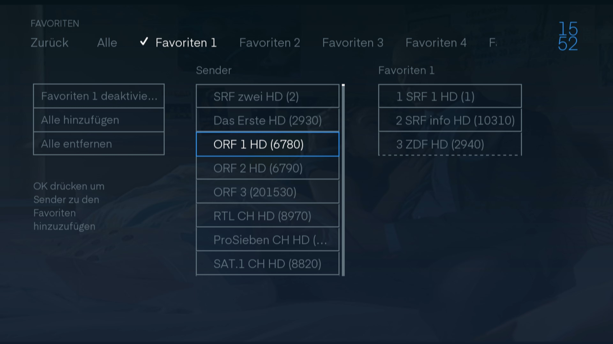

## Profile

Falls Sie mehrere Pesonen sind, die das TV brauchen, können Sie für jede Person ein `Profil` erstellen. In den Profilen können die einstellungen in `Audio und Video` und in den `Favoriten` unterschieden werden. So können Sie Diskussionen, wie wer hat wieder ... umgehen.

Links finden Sie die Schaltflächen um alles einzustellen. Wenn Sie ein profil bennenen müssen Sie die Tastatur auf der Fernbedienung nutzen.

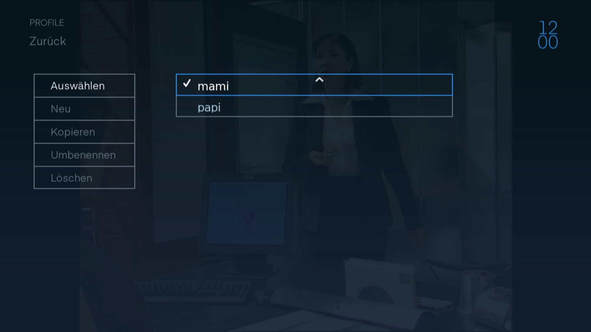

## Audio & Video

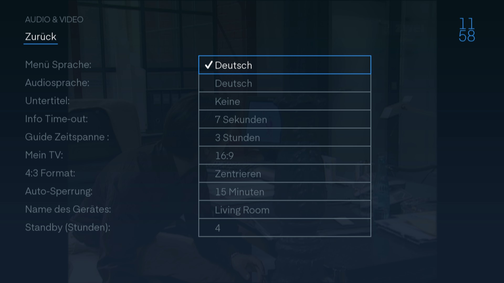

### Menü Sprache

In welcher Sprache soll die Oberfläche sein?

### Audiosprache

Es gibt sender die übertragen mehr als eine Sprache. Hier können sie einstellen welche Sprache gewählt werden soll. Die Audiosprache kann von Sender zu sender eingestellt werden. Weitere Infos finden Sie [hier](../senderinformation/#sprache).

### Untertitel

Sie können Standartmässig Untertitel einschalten. Wenn der Sender diese zur Verfügung stellt werden sie angezeigt. Es gibt Sender die haben Untertitel in mehreren Sprachen es wird die Sprache präferiert die Sie ausgewählt haben. Die Untertitel kann von Sender zu sender eingestellt werden. Weitere Infos finden Sie [hier](../senderinformation/#sprache).

### Info Time-out

Sie können einstellen wie lange der Infobanner zu sehen sein soll. Bis er automatisch wieder ausgeblendet wird.

### Guide Zeitspanne

Hier können Sie einstellen wie viel Zeit im Guide angezeigt werden soll. Wenn Sie 3 Stunden wählen sehen sie einfach den Zeitplan von 3 Studen. Wenn Sie scrollen machen sie es in den Schritten die Sie ausgewält haben.

### Mein TV

Hier können Sie einstellen welches Verhältnis Ihr TV-Schirm hat.

### 4:3 Format oder 16:9 Format

Hier können Sie einstellen was mit den Fernsehbilder des jeweis anderen Formates geschehen soll. Im Hintergrund können Sie sehen wie es danach aussehen wird.

### Auto-Sperrung

Hier können Sie die Frist der Adminberechtigung einstellen.

### Name des Gerätes

Geben sie Ihrer Box einen namen aus der vordefinierten Liste.

### Standby

Hier können Sie einstellen nach welcher Zeit ohne Interaction das Gerät abschalten soll.

## System Information

In den System Informationen können Sie Infos über Ihr TV herauslesen.

### TV-Box

Unter TV-Box finden Sie verschiedene Infos über die Box und die Software. Ebenfalls finden Sie die Serialnummer und die MAC-Adresse, die für den Support wichtig sind.

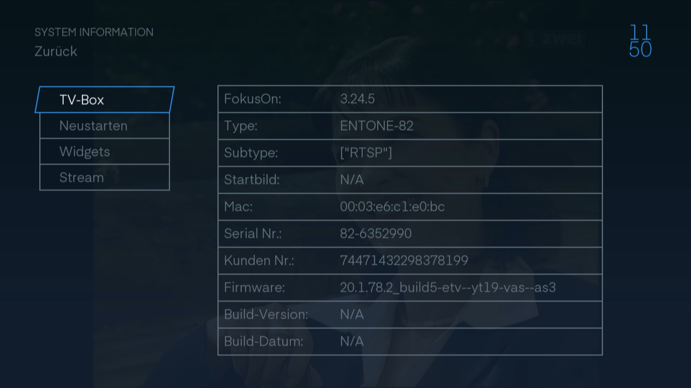

### Neustart

Wenn Sie `Portal neu laden` wählen wird die Softwar neu geladen. Dies kann helfen wenn etwas kleines schiefgelaufen ist.

Falls Sie `TV-Box neu starten` wählen wird die ganze Box neu gestartet. Sie können auch einfach den Strom der Box aus und wieder ein stecken. Dies kann helfen bei gröberen Fehlern.

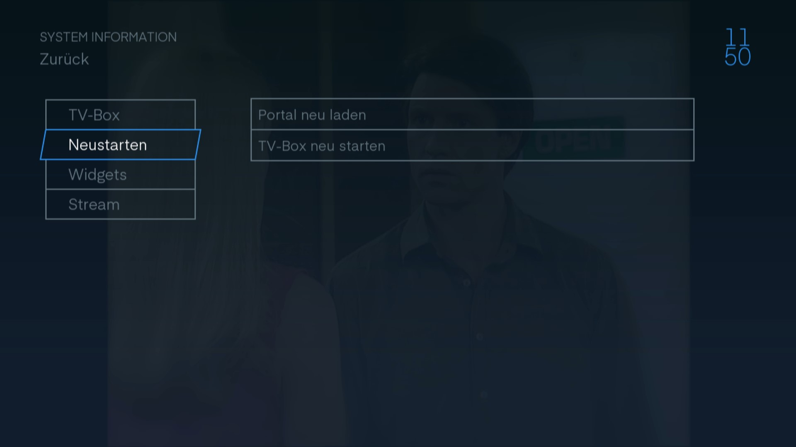

### Widgets

Unter Wigets finden Sie die Verwendete Software und die Version dazu.

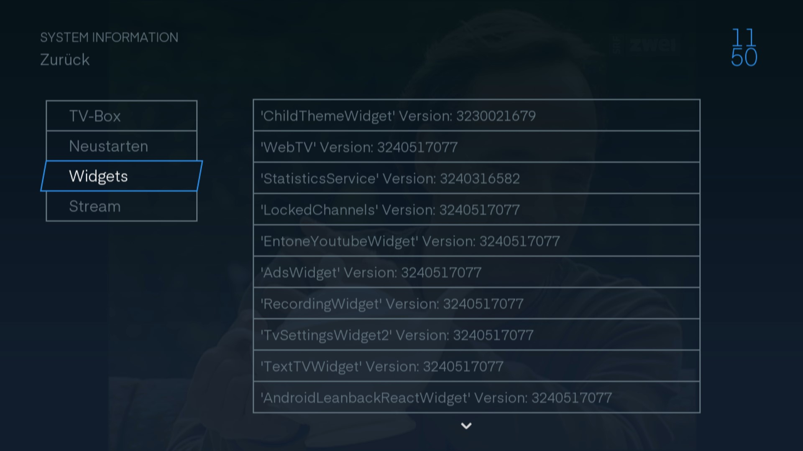

### Stream

Hier können Sie sehen, welche Kodierung verwendet wird und welche Framrate.

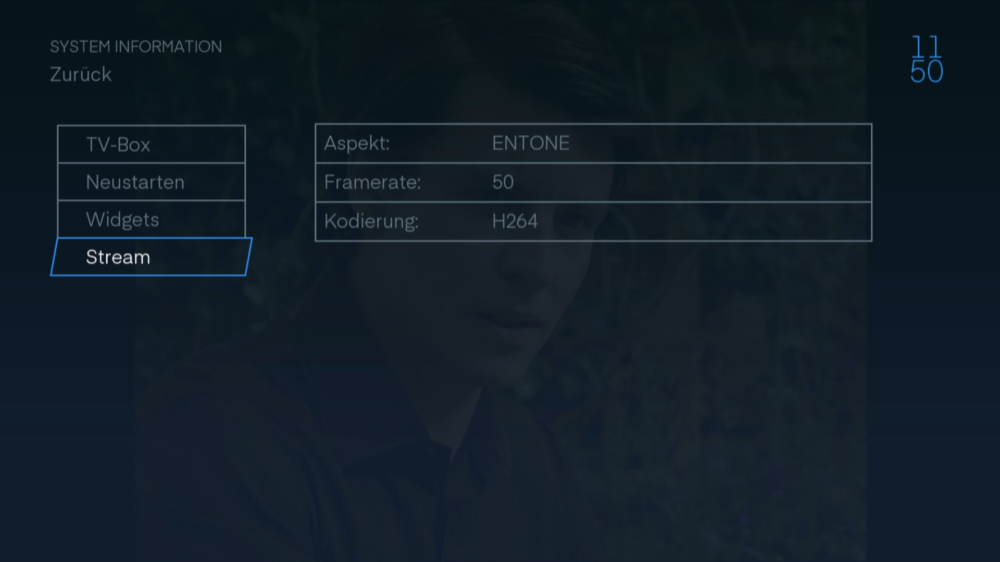

## Systementsperrung

Dieser Knopf gibt ihnen Adminberechtigungen für 15 min. Diese Berechtigung wird gebraucht um die folgenden Einstellungen zu verwalten.

Falls Sie mit Ihren Einstellungen vor dem Ablauf der Zeit zufrieden sind, können Sie die Berechtigung auch manuel wieder aufheben, in dem Sie auf den gleichen Knopf drücken.

## Altersfreigabe

Die Altersfreigabe sperrt alle Sendungen die über der Alltersbegrenzung stehen. Diese Informationen werden vom Sender bereitgestellt.

Dazu brauchen sie den `Master PIN`.

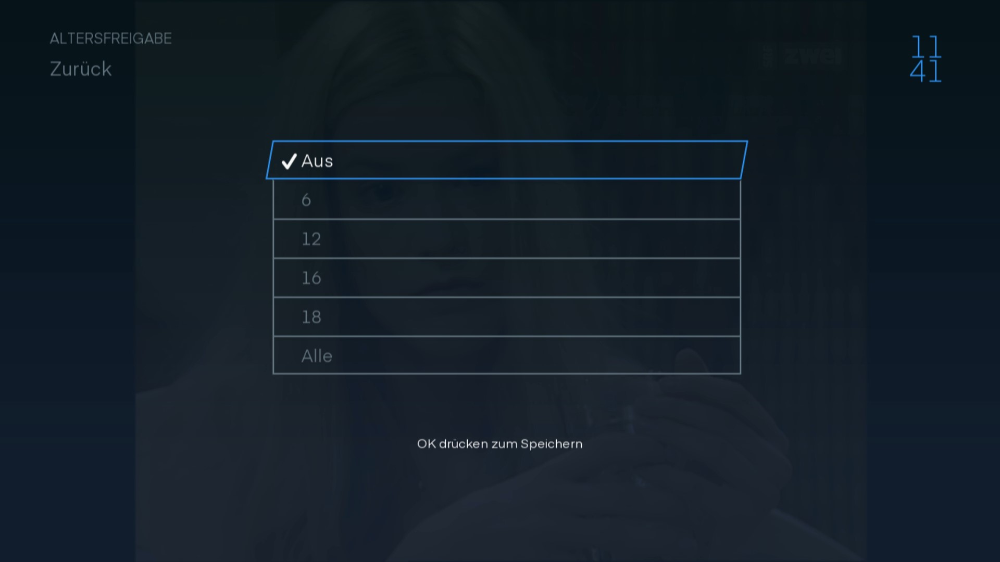

## Sendersperrung

Wenn Sie nicht möchten, dass bestimmte Sender auf Ihrer TV Box nicht geschaut werden können Sie unter `Sendersperrung` jeden einzelnen Sender Sperren.

Dazu brauchen sie den `Master PIN`. Nun einfach den Sender auswählen und mit `OK` den Sender sperren oder entsperren.

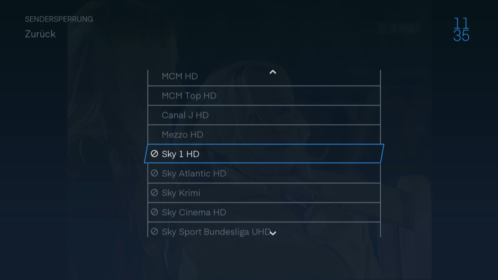

## Master PIN

Mit dem Master PIN können Sie Funktionen einschränken. Oder sich einfach absichern vor nicht autorisierter Bedienung.

Dieser PIN ist wie das Admin Passwort Ihrer TV-Box. Auf dieser Seite können Sie den PIN ändern.

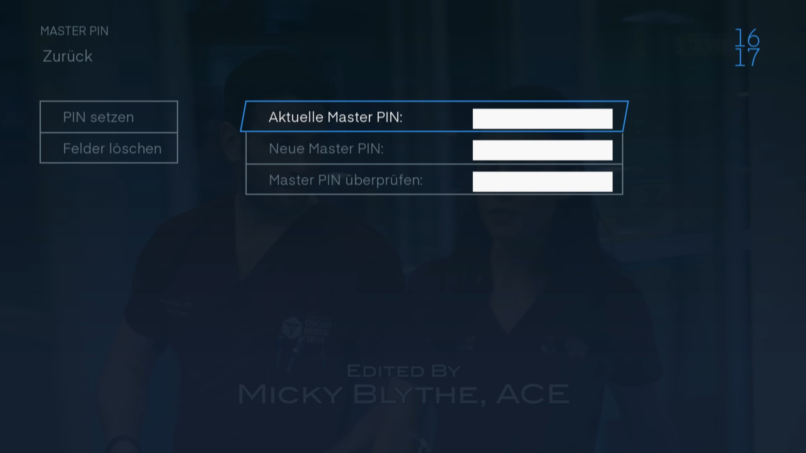 

## Pairing-PIN

Wenn Sie die App oder an ihrem Computer Fernsehen wollen oder Ihre Aufnahmen abrufen, können Sie hier den Pairing-PIN holen.

[Anleitung App und Web-TV](../../mobile "Mobile-TV")

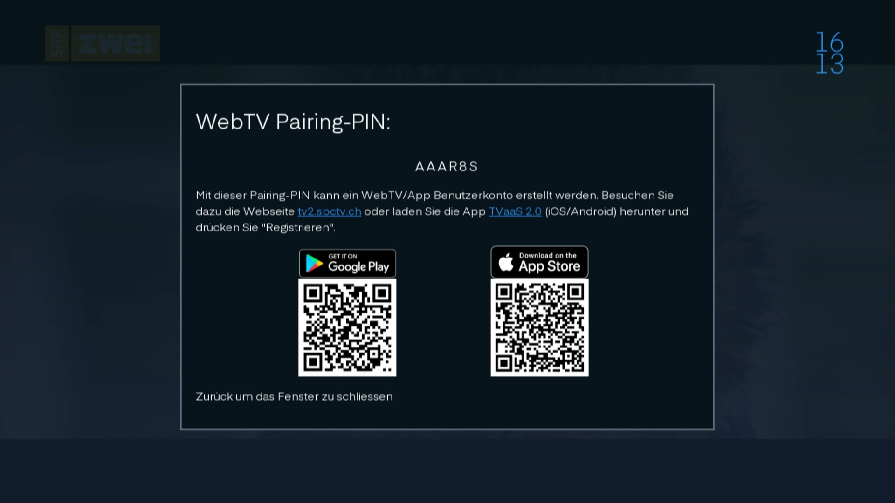