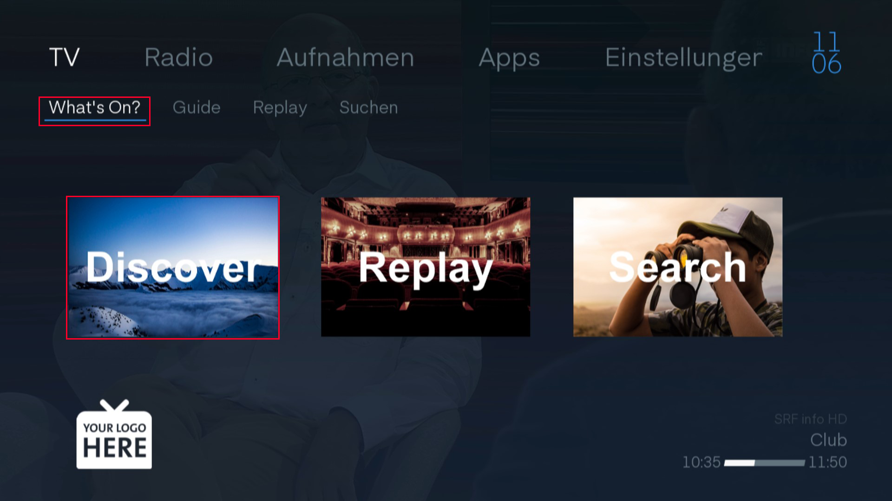
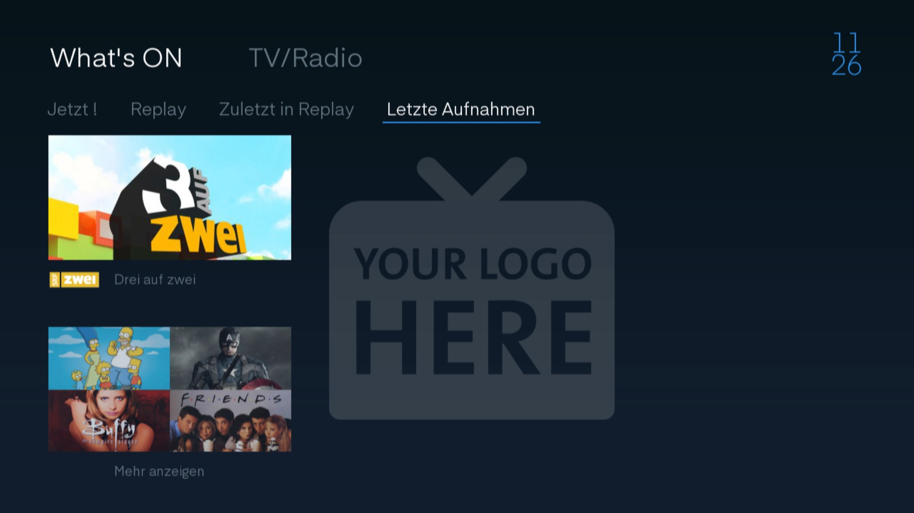
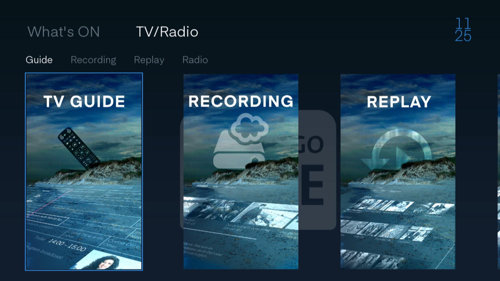
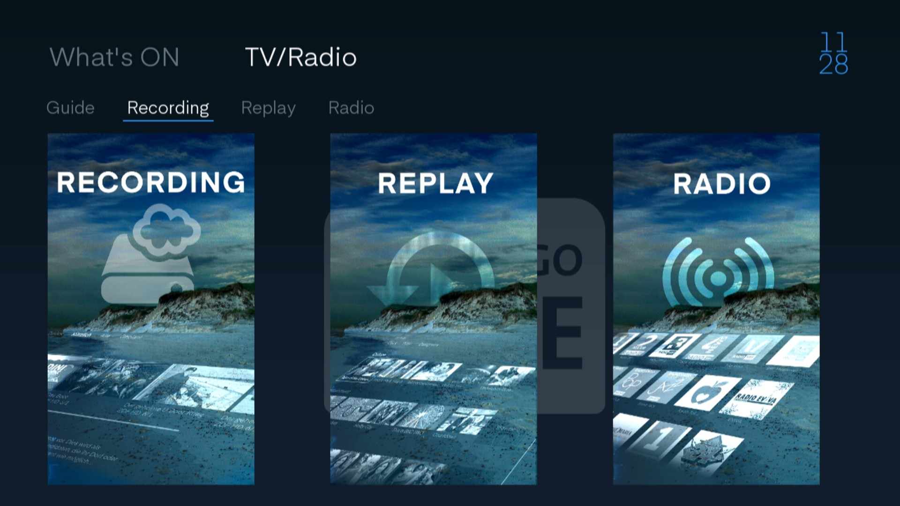
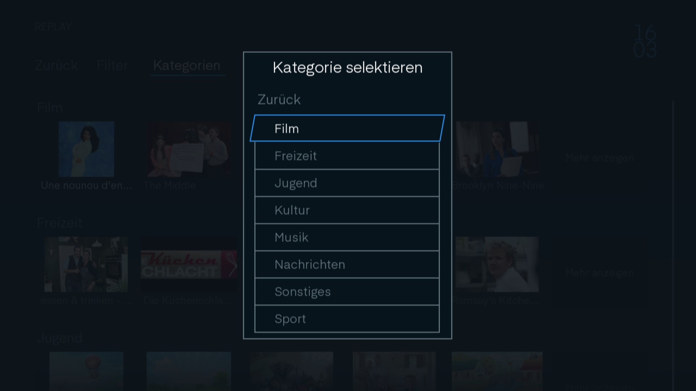
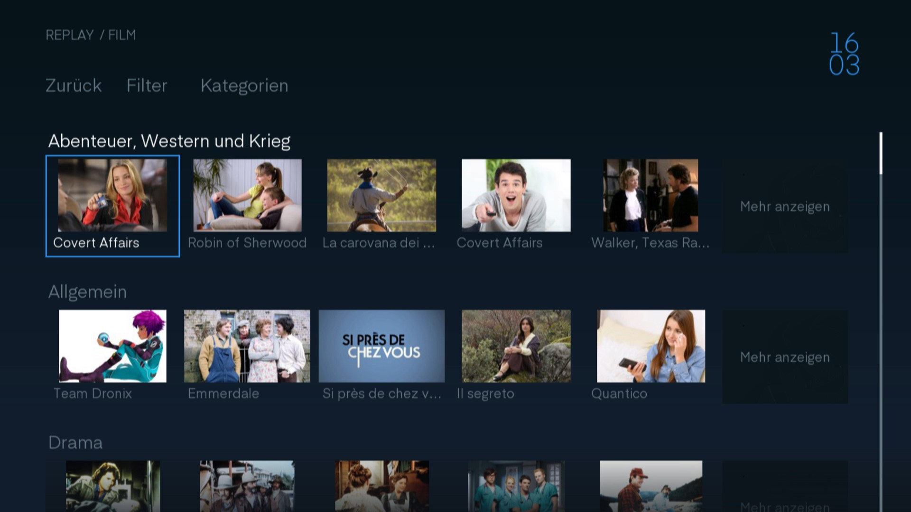
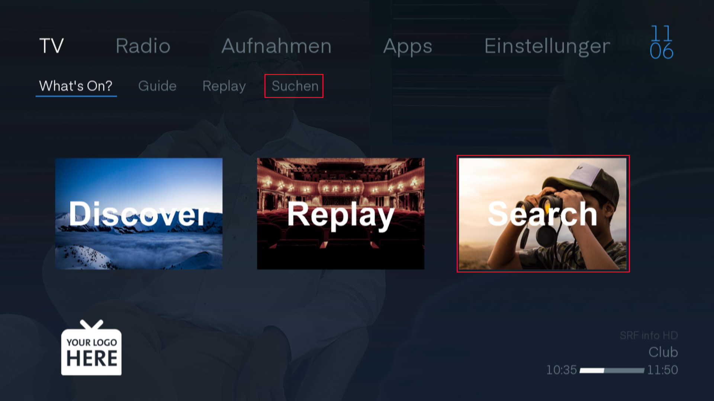

# TV Programm

Wenn Sie auf Ihrer Fernbedienung auf  klicken. Kommen Sie in den Home-Bildschirm. Navigieren Sie nun zu `TV`.

## What's On?

Navigieren Sie zu `What's On?` oder auf die grosse Schaltfläche `Discover`.

 

### What's On?

Nun sind Sie auf dem What's On Bildschirm. Diese Ansicht ist wie ein On-Demand-Store aufgebaut.

#### Jetzt!

Hier sehen Sie das Programm, dass sie gerade schauen.

 

#### Replay

Bei Replay sind alle Kategorien aufgelistet, die im Moment im Replay zur Verfügung stehen.

Die Zahlen hinter den Kategorien zeigen wie viele Sendungen in dieser Kategorie zur Verfügung stehen.

 

Wenn Sie eine Kategorie auswählen kommen Sie in die Replay Bibliothek direkt zu der gewählten Kategorie. 

#### Zuletzt in Replay

Sendungen, die Sie gerade verpasst haben, werden hier aufgelistet. Diese Ansicht eignet sich hervorragend zum Schmökern.

 

#### Letzte Aufnahmen

Sie haben wahrscheindlich eine Serie abonniert zum Aufnehmen oder haben weit in der Zukunft eine Sendung zum Aufnehmen gekennzeichnet. Dann können Sie hier die frisch aufgezeichneten Sendungen finden.

Wenn Sie auf `Mehr anzeigen` gehen kommen Sie zu Ihren Aufnahmen.

 

### TV/Radio

Sie können auf der What's On Seite zu der `TV/Radio` Schaltfläche navigieren.

#### Guide

Wenn Sie Guide wählen kommen sie in den TV Guide.

 

#### Recording

Wenn Sie Recording wählen kommen Sie in ihre Aufnahmebibliothek.

 

#### Replay

Wenn Sie Replay wählen kommen Sie in den On-Demand-Store.

 

#### Radio

Wenn Sie Radio wählen kommen sie zur Radioauswahl.

 

## Guide

Im Guide können Sie sehen was gerade auf den Sendern läuft und welche Sendungen folgen.

Navigieren Sie durch die Sendungen und sie können unten den Sendungsnamen, die Beschreibung und die Zeit sehen.

Wenn Sie die Sendung mit `OK` auswählen kommen sie in die Sendung oder wenn die Sendung schon vergangen ist ins Replay, wenn verfügbar.

Mit den Knöpfen  und  können Sie Tageweise springen. Mit den Knöpfen  und  in drei Stunden Sprünge.

> Wie viele Stunden angezeigt werden, können Sie in den Einstellungen einstellen.

 

### Sendung aufnehmen

Sie können mit dem  Knopf auf der Fernbedienung die Sendung aufnehmen.

Sie können Sendungen, die aufgenommen werden anhand des roten Punktes erkennen.

 

Wenn sie bei einer Sendung, die zum Aufnehmen markiert ist, nochmal auf  drücken, kommen sie ins Aufnahmemenu.

Mit `Schliessen` kann man das Fenster wieder schliessen.

Mit `Löschen` unterbricht man die Aufnahme und das bereitsaufgenommene wird gelöscht.

Unter `Wiederholden` kann man mit den Navigationstasten einstellen ob nur diese Sendung oder die ganze Serie der Sendungen aufgenommen werden soll. Sozusagen ein Serien Aufnahme Abo.

 

### Sendungsinfo

Drücken Sie  und Sie kommen in [Sendungsinfo](../senderinformation/#infomenu "Sendungsinfo") der gewählten Sendnung.

## Replay

Wenn Sie auf `Replay` navigieren, kommen Sie in den Replay Store.

 

Im Replay Store können Sie alle Sendungen finden, die im Replay verfügbar sind. Hier sind sie schön geordnet nach Kategorie.

 

Filtern Sie Ihre Auswahl nach Sprache in dem Sie nach `Filter` navigieren. Hier können sie die gewünschte Sprache auswählen.

 

### Kategorie

Jede Kategorie hat noch Unterkategorien. Sie gelangen zu den Unterkategorie, in dem Sie entweder bei der Kategorie auf `Mehr anzeigen` gehen oder in dem Sie oben auf Kategorie klicken. Hier können Sie nun die Kategorie auswählen und kommen so zu den Unterkategorien.

 

Nun sind Sie in der Kategorie und sehen Sendungen, die in Unterkategorien gegliedert sind. Auch hier können Sie mit `Mehr anzeigen` alle Sendungen der Unterkategorie anzeigen. Ebenfalls können Sie wie bei den Kategorien über die Schaltfläche `Kategorie` in die unter Kategorie navigieren.

 

### Replayinfo

Wenn Sie eine Sendung auswählen, kommen Sie zuerst auf die Info zur Sendung. Hier finden sie eine Beschreibung und wann und auf welchem Sender diese Sendung gelaufen ist.

Hier haben Sie nun die Möglichkeit die Sendung `Aufnahme` so könne Sie die Sendung für Sie abrufbar machen auch wenn die Sendung wegen der Replay Grenzen nicht mehr zur Verfügung steht. Oder sie wählen `Abspielen`. Dann wird die Sendung wiedergegeben.

 

## Suchen

Wenn Sie auf die Schaltfläche `Suchen` gehen, haben sie die Möglichkeit eine Sendung zu suchen.

 

Sie haben zwei Gefässe, in denen Sie suchen können. Zum einen das Guide Gefäss, in dem alle zukünftigen und derzeitigen Sendungen zu finden sind. Und das Replay Gefäss, in dem alle Sendungen zu finden sind die zum Replay zur Verfügung stehen.

Suchen Sie nach einer Sendung indem Sie die Pfeiltasten auf der Bildschirmtastatur brauchen. Dazu müssen Sie mindestens zweit Zeichen eingeben, damit die Suche startet.

Wenn Sie eine Sendung auswählen kommen Sie auf die [Sendungsinfo](../senderinformation/#infomenu "Sendungsinfo"). Die verkürzte Version finden Sie auch ganz rechts.

 