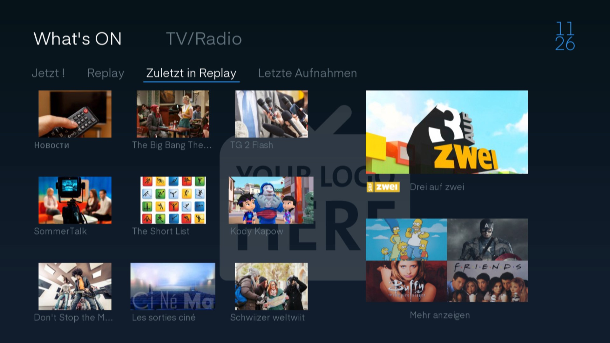
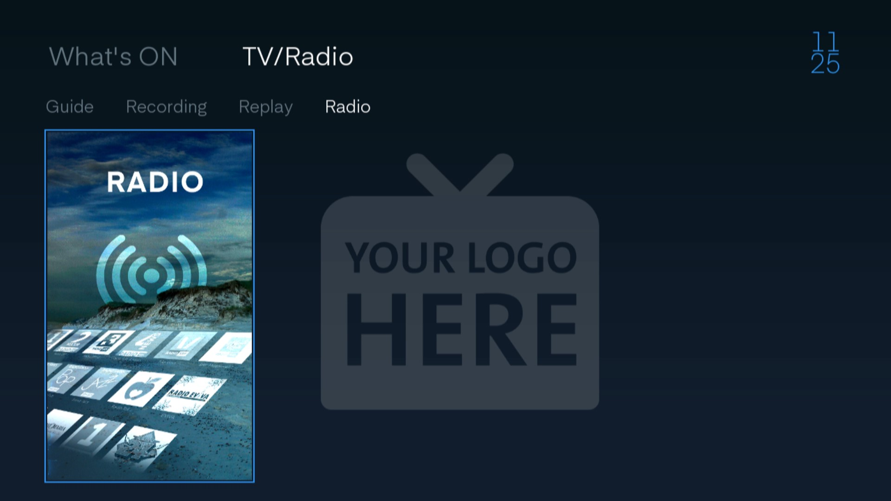
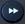
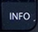
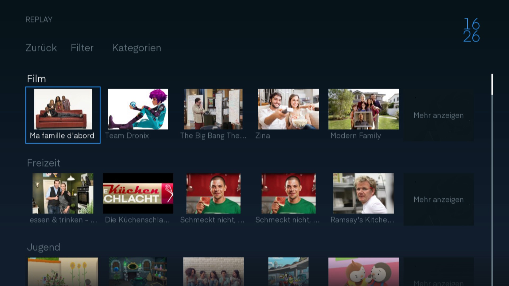
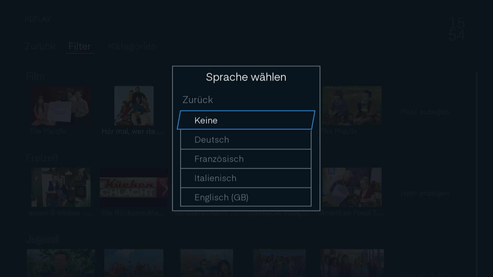
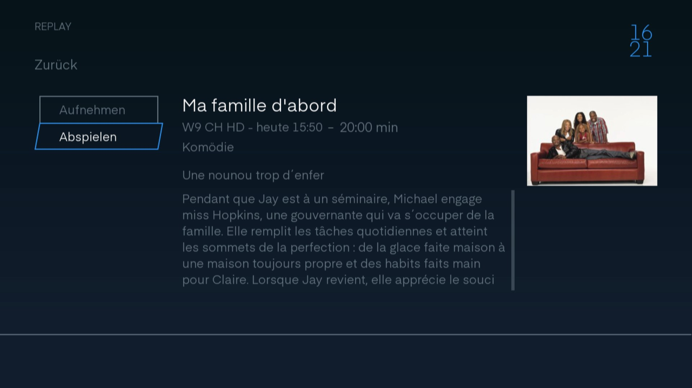
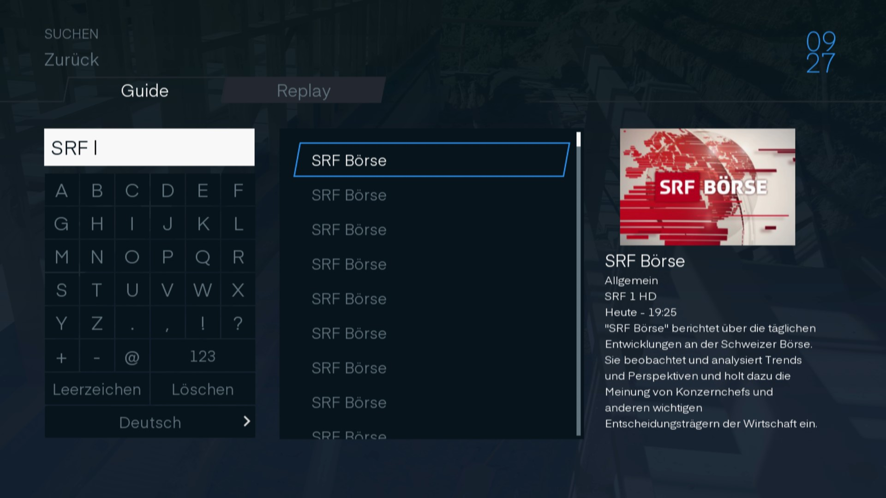

# TV Programm

Klicken Sie auf die  Taste und gelangen Sie zum Home-Bildschirm. Navigieren Sie nun zu `TV`.

## What's On?

Navigieren Sie zu `What's On?` oder auf die grosse Schaltfläche `Discover`.

 

### What's On?

Sie befinden sich nun auf dem What's On Bildschirm. Diese Ansicht ist wie ein `On-Demand-Store` aufgebaut.

#### Jetzt!

Hier ersichtlich, welche Sendung Sie gerade schauen.

 

#### Replay

Alle Sendungen, die im «Replay-Modus» verfügbar sind, sind als Kategorie aufgelistet.

In jeder Kategorie ist gekennzeichnet, wie viele Sendungen der jeweiligen Kategorie verfügbar sind.

 

Wählen Sie eine Kategorie aus und gelangen Sie direkt zu den verfügbaren Sendungen dieser Kategorie.

#### Zuletzt in Replay

Sendungen, die Sie gerade verpasst haben, werden hier aufgelistet. Diese Ansicht eignet sich hervorragend zum Schmökern.

 

#### Letzte Aufnahmen

Haben Sie eine Serie abonniert oder eine Sendung, welche in der Zukunft liegt, zum Aufnehmen gekennzeichnet. Dann können Sie hier die kürzlich aufgezeichneten Sendungen finden.

Mit `Mehr anzeigen` gelangen Sie zu Ihren Aufnahmen.

 

### TV/Radio

Sie können auf der What's On Seite zu der `TV/Radio` Schaltfläche navigieren.

#### Guide

Wählen Sie Guide haben Sie die Möglichkeit, die Schaltfläche «TV Guide» zu klicken.

 

#### Recording

Wenn Sie `Recording` wählen, gelangen Sie in Ihre Aufnahmebibliothek.

 

#### Replay

Wenn Sie Replay wählen, gelangen Sie in den `On-Demand-Store`.

 

#### Radio

Wählen Sie Radio, wenn Sie zur Radioauswahl navigieren möchten.

 

## Guide

Im Guide sehen Sie, was aktuell auf den Sendern läuft und welche Sendungen folgen.

Navigieren Sie durch die Sendungen, erhalten Sie Informationen über den Namen, die Sendung und die Zeit.

Wählen Sie die Sendung mit `OK` aus, gelangen Sie direkt zur Sendung. Oder, falls die Sendung bereits zu Ende ist, in den Replay-Modus.

Mit den Tasten  und  springen Sie von einem Tag zum anderen. Mit den Knöpfen  und  springen Sie in 3h Sprüngen.

> Wie gross die angezeigte Zeitspanne ist, ist abhängig von Ihren Einstellungen [hier](../einstellungen/#guide-zeitspanne).

 

### Sendung aufnehmen

Nehmen Sie die gewünschte Sendung auf mit der  Taste auf Ihrer Fernbedienung.

Sendungen, die aufgenommen werden, erkennen Sie anhand eines roten Punktes.

 

Wenn Sie bei einer Sendung, die zum Aufnehmen markiert ist, nochmal auf  drücken, gelangen Sie ins Aufnahmemenu.

Schliessen Sie das Fenster mit der Schaltfläche `Schliessen`.

Mit `Löschen` unterbrechen Sie die Aufnahme und das bereits Aufgenommene wird gelöscht.

Unter `Wiederholden` stellen Sie mit den Navigationstasten ein, ob nur diese Sendung oder die ganze Serie der Sendungen aufgenommen werden soll. Sozusagen ein "Serien Aufnahme-Abo".

 

### Sendungsinfo

Drücken Sie  und Sie gelangen in die [Sendungsinfo](../senderinformation/#infomenu "Sendungsinfo") der gewählten Sendung.

## Replay

Klicken Sie auf die Schaltfläche `Replay`, gelangen Sie in den Replay Store.

 

Im Replay Store können Sie alle Sendungen finden, die im Replay verfügbar sind. Diese sind nach Kategorie geordnet.

 

Filtern Sie Ihre Auswahl nach Sprache in dem Sie mit der Schaltfläche `Filter` navigieren. Wählen Sie hier die gewünschte Sprache aus.

 

### Kategorie

Jede Kategorie ist in Unterkategorien unterteilt. Sie gelangen zu den Unterkategorien, in dem Sie entweder bei der Kategorie auf die Schaltfläche `Mehr anzeigen` klicken oder in dem Sie direkt auf den Button Kategorie klicken. Hier können Sie nun die Kategorie auswählen und gelangen so zu den Unterkategorien.

 

Nun sind Sie in der Kategorie und sehen Sendungen, die in Unterkategorien gegliedert sind. Auch hier können Sie mit `Mehr anzeigen` alle Sendungen der Unterkategorie anzeigen. Ebenfalls können Sie, wie bei den Kategorien über die Schaltfläche `Kategorie` in die Unterkategorie navigieren.

 

### Replay-Info

Wählen Sie eine Sendung aus und erhalten Sie direkt verschiedene Informationen, wie eine kurze Beschreibung des Inhalts und, auf welchem Sender die Sendung zu welchem Zeitpunkt ausgestrahlt wurde. 

Klicken Sie auf die Schaltfläche `Aufnahme` und rufen Sie die Sendung auf (auch wenn sie auf Replay nicht mehr verfügbar ist). Oder Sie wählen `Abspielen`. Dann wird die Sendung wiedergegeben.

 

## Suchen

Mit der Schaltfläche `Suchen` können Sie nach einer bestimmten Sendung suchen.

 

Sie haben zwei Gefässe, in denen Sie eine Sendung suchen können. Einerseits im `Guide`, in dem alle zukünftigen und derzeitigen Sendungen zu finden sind. Und unter `Replay`, in dem alle Sendungen zu finden sind, die als Replay zur Verfügung stehen.

Suchen Sie nach einer Sendung indem Sie die Pfeiltasten auf der Bildschirmtastatur betätigen. Dazu müssen Sie mindestens zwei Zeichen eingeben, damit die Suche startet.

Wenn Sie eine Sendung auswählen, erscheint [Sendungsinfo](../senderinformation/#infomenu "Sendungsinfo"). Die verkürzte Version finden Sie auch ganz rechts im Bild.

 