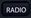
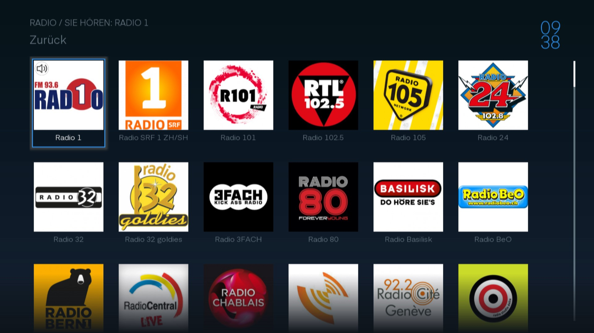

# Radio

Mit der  Taste, oder über das Menu via Radio, können Sie Radio hören.

## Senderliste

Navigieren Sie mit den Pfeiltasten durch die Sender und wählen sie mit  den gewünschten Sender.

## Radioansicht

Wenn Sie einen Radio ausgewählt haben sehen sie nun auf dem Bildschirm das Logo des Radios. Unter dem Logo sehen Sie der Name des Radios und in der Zweiten Zeile, welches Lied oder welche Sendung gerade läuft.

