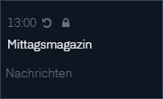
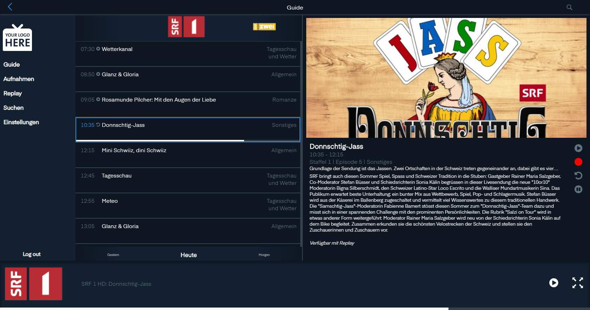
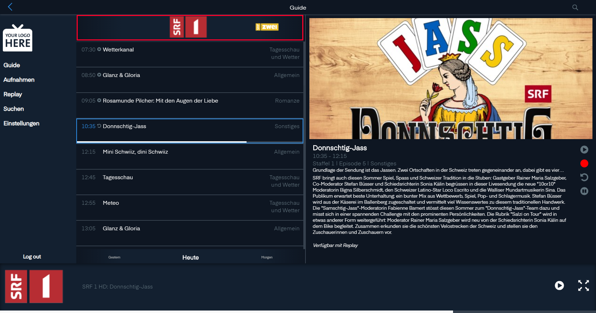

# Guide

Der Guide ist unter `Guide` in der Navigation zu finden.

## Senderliste

Hier sind alle Sender aufgelistet mit dem akuellen Programm und den folgenden Sendungen.

> Die Reihenfolge der Sender kann in den Einstellungen angepasst werden

### Programmpunkt

Zu oberst im Programmpunkt ist ersichtlich, wann die Sendung beginnt.

Neben der Startzeit kann es Icons haben.

 Bedeutet: Zurückspulen im Programmpunkt ist möglich.

 Bedeutet: Der Inhalt ist blockiert.

Unterhalb ist der Programmnamen ersichtlich.

Und wiederum darunter befindet sich die Kategorie der Sendung. Die Kategorien finden sich bei `Replay` wieder.

## Sender Programm

Klickt mann auf den  erscheint die Liste mit den vergangenen und zukünftigen Sendungen eines Senders.

### Senderauswahl

Mit einem Klick auf ein Senderlogo erhalten Sie die Einsicht in das Programm des Senders.

### Programmauswahl

Links neben dem Programmnamen finden Sie den Startpunkt der Sendung.

Zwischen Startzeit und Programmnamen findet sich möglicherweise ein Icon.

 Bedeutet: Die Sendung wurde schon ausgestrahlt und kann nachgeschaut werden.

 Bedeutet: Die Sendung läuft und lässt sich zurückspulen.

Rechts vom Programmnamen finden Sie die Kategorie der Sendung.

Je nach Sendung und TV-Sender taucht in der zweiten Zeile das  Icon auf. Das bedeutet, der Inhalt ist blockiert.

### Zeitauswahl

Zu unterst kann man Tag für Tag durch das Programm navigieren.

