# Aufnahmen

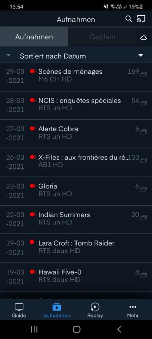

Die Navigation wird über die Knöpfe `Aufnahmen`, `Geplant` und `Cloud` gesteuert.

## Aufnahmen

Der Menütitel  zeigt an, dass wir uns jetzt im Bereich «Aufnahmen» befinden. Im Menübalken unten wird das farblich hervorgehoben.

Bei  wird im Registermenü die Liste von bereits vorhandenen Aufnahmen angezeigt.

### Sortierung

Bei der Option  gibt es folgende Auswahlmöglichkeiten:

- Sortiert nach Datum
- Sortiert nach Alphabet

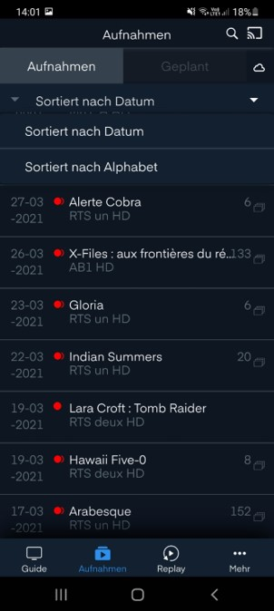

Für beide Optionen können unterschiedliche Reihenfolgen gewählt werden:

- A bis Z oder Z bis A
- Old nach New oder New nach Old

### Aufnahmeliste

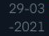 Das Ausstrahlungsdatum wird angezeigt. Bei einer Serie wird immer das Datum der zuletzt aufgenommenen Episode dargestellt.

Ein 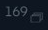 wird gezeigt, falls es sich um eine Serie handelt. Eine Zahl zeigt die Anzahl der aufgenommenen Episoden an. Fehlt das Icon handelt es sich um eine Einzelsendung.

#### Einzelsendungen und Filme

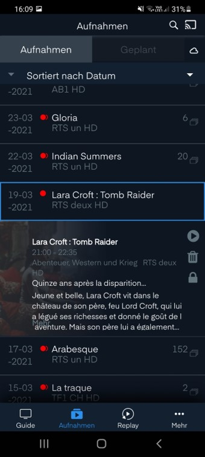

Ebenfalls in der Übersicht wird der Inhalt des Films angezeigt.

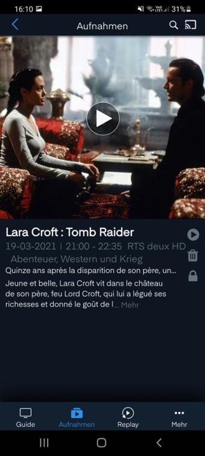

Klickt man einen Film an, erhält man eine Übersicht über dessen Genre.

#### Serien

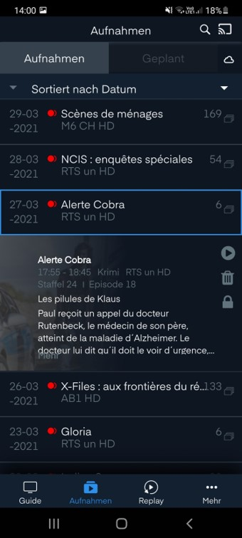

Klickt man eine Serie an, erhält man eine Übersicht über den Inhalt der Episode.

Klickt man auf den Text, erscheint eine Übersicht über die einzelnen Episoden der Serie.

### Aufnahmeübersicht

In der Übersicht einer Sendung/Serie oder in der Detailansicht einer Sendung/Serie können folgende Aktionen getätigt werden:

-  Anschauen der Sendung oder Episode
-  Löschen der Sendung oder Episode 
-  Schützen der Sendung oder Episode (vor einer ungewünschten Löschung)

> Wichtig:
>
> - Um eine Serie zu löschen oder zu schützen, muss jede einzelne Episode gelöscht oder geschützt werden.
> - Um eine ganze Serie auf einmal zu löschen, muss dies via «Guide-Menü» gemacht werden.

## Geplant

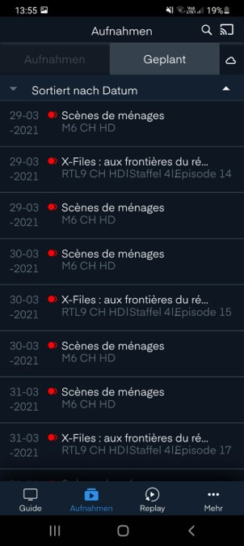

Bei der Option  im Registermenü wird die Liste von bereits programmierten Aufnahmen gezeigt.

### Sortierung

 Das Ausstrahlungsdatum wird angezeigt. In Fall einer geplanten Serie wird jede Episode einzeln aufgelistet.

Für die geplanten Aufnahmen gibt es folgende Möglichkeiten bei der Option :

- Sortiert nach Datum
- Sortiert nach Alphabet

Für beide Optionen können unterschiedliche Reihenfolgen gewählt werden:

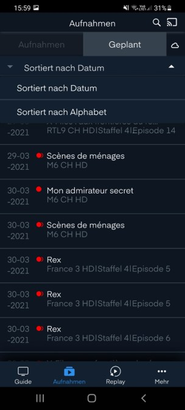

- A bis Z oder Z bis A
- Old nach New oder New nach Old

## Cloud

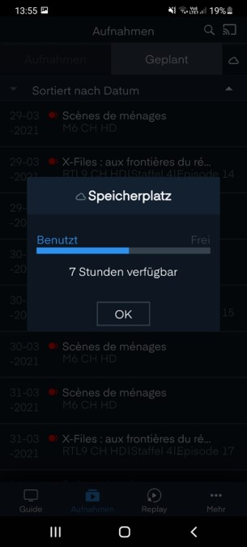

Bei der Option 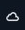 im Registermenü wird der noch verfügbare Speicherplatz angezeigt.
