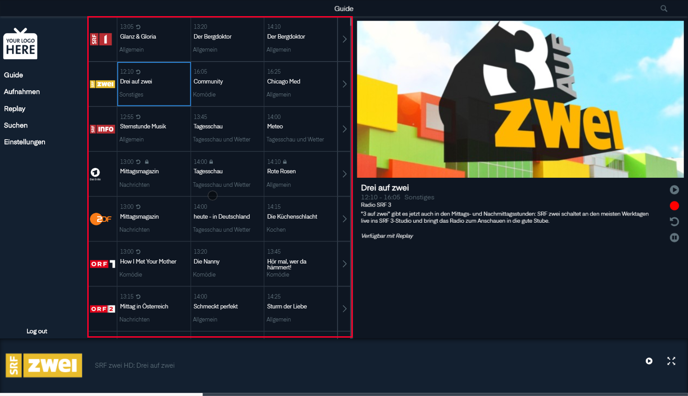
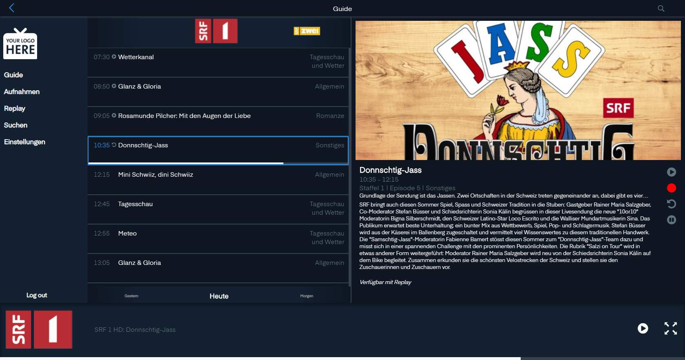
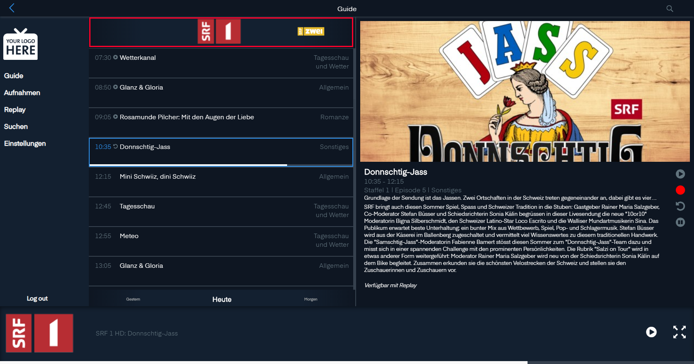

# Guide

Der Guide ist unter Guide in der Navigation zu finden.

## Senderliste

Hier sind alle Sender aufgelistet mit dem akuellen Programm und den folgenden Sendungen.

> Die Reihenfolge der Sender kann in den Einstellungen angepasst werden

### Programmpunkt

Im Programmpunkt kann man zu oberst sehen wann die Sendung beginnt.

Neben der Startzeit kann es Icons haben.

 Bedeutet das man im Programmpunkt zurückspulen kann.

 Bedeutet das der Inhalt Blockiert ist.

Darunter kann man der Programm nahme sehen.

Und wiederum darunter ist die Kategorie der Sendung. Die Kategorien findet man bei Replay wieder.

## Sender Programm

Wenn man auf den  klickt kommt man auf die Liste mit den vergangenen und zukünftigen Sendungen eines Senders.

### Senderauswahl

Zu oberst kann man nach der Senderliste durch die Sender Zappen.

### Programmauswahl

In der Programm auswahl sieht man zu vorderst der Startpunkt der Sendung.

Danach findet man den Programmname.

Zwischen dem Startzeit und dem Programmnamen kann es ein Icon haben.  Beduetet das die Sendung schon gelaufen ist und sie nun nachgeschaut werden kann.  zeigt an das die Sendung läuft und man zurückspulen kann.

Hinter dem Programmnahmen ist die Kategorie der Sendung.

Je nach Sendung und Fehrnsehsender taucht in der zweiten Zeile das  Icon auf. Das beudetet, dass der Inhalt blockiert ist.

### Zeitauswahl

Zu unterst kann man Tag für Tag durch das Programm navigieren.

## Sendungsinfo