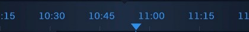
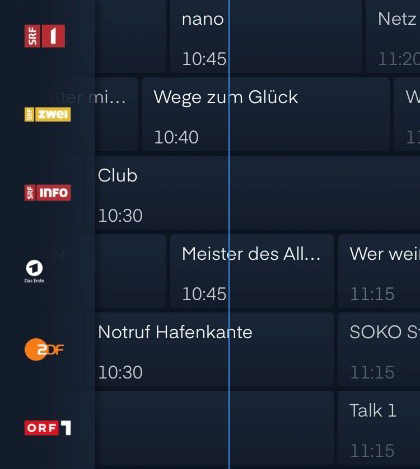
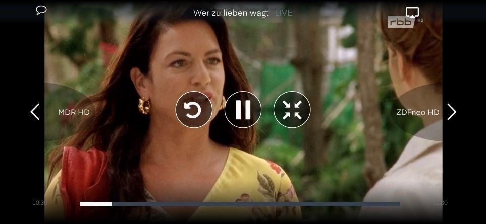
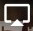
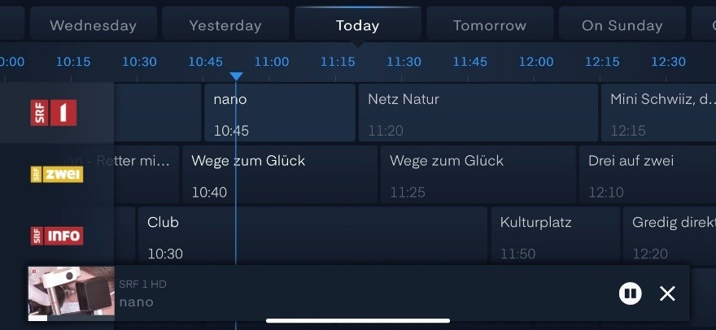
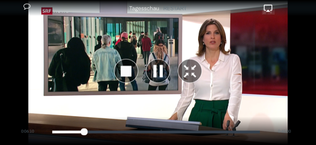
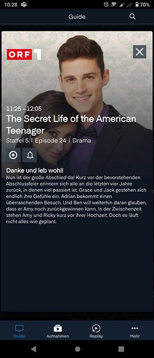
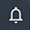
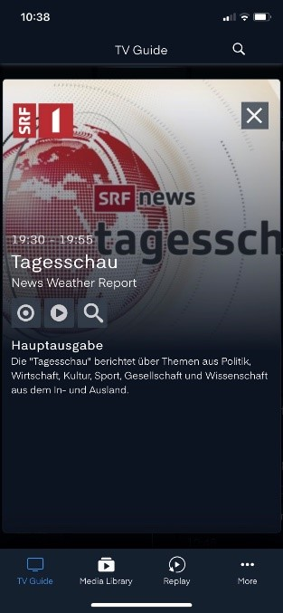

# Guide

Der Guide ist unter Guide im Menü zu finden.

 Lupe rechts oben (Suchen) wird unter «More» beschrieben

## Oberster Balken (Tag)

Man kann nach links oder nach rechts scrollen, um im Programm-Guide nach Sendungen in der Vergangenheit oder in der Zukunft zu suchen. Man kann den Tag auswählen, indem man den entsprechenden Tab anklickt. Optionen: Today, Yesterday und Tomorrow sowie bis 7 Tage zurück mittels Wochentagname oder 7 Tage voraus mittels «on Tagesname»

Der aktuell dargestellte Tag steht immer in der Mitte.

## Zweiter Balken (Uhrzeit)

Auch hier scrollt man nach links oder nach rechts, um die gewünschte Uhrzeit darzustellen.

Die aktuelle Uhrzeit wird gekennzeichnet mittels eines kleinen Dreiecks und einer vertikalen Linie durch die Programme der betreffenden Sender.

Sobald man sich auf der Zeitachse in der Vergangenheit befindet, kann man den -Knopf rechts oben drücken, um zur aktuellen Uhrzeit zurückzuspringen. Wenn man sich in der Zukunft bewegt, steht der -Knopf links oben, mit welchem man zu «Now» zurückspringen kann.

## Hauptfeld

Hier werden links die Fernsehsender mittels Logo angezeigt.

Scrollen mitten im Bildschirm von oben nach unten (und umgekehrt) zeigt die verfügbaren Sender.

Ein Sender-Logo anklicken bewirkt, dass man zum Live-Programm dieses Senders wechselt.

Scrollen von links nach rechts oder von rechts nach links bewirkt, dass man sich durch die Zeitachse schiebt (Vergangenheit und Zukunft). Wenn man das auf der Höhe eines Senders macht (statt auf dem Zeitbalken), dann scheint es, als würde man nur bei diesem Sender die Zeit schieben, aber wenn man fertig ist mit Schieben, passt sich der ganze Guide wieder an die gewünschte Zeit an.

## Live-Programm

Wenn man bei einem Sender ins Live-Programm einsteigt, kann man die folgenden Optionen anklicken:

-  links oben: Audiospur und Untertitel einstellen
- Text in der Mitte oben: Name der aktuellen Sendung
-  rechts oben: externe Geräte wie AirPlay/Chromecast oder Speakers auswählen
- Pfeile links und rechts vom Bildschirm (inkl. Sendername): zappen auf vorherige oder nächste Sender 
-  Start Sendung von vorne
-  Pause oder  Play
-  Fernsehbild wieder verkleinern, um zum TV Guide zurückzukehren
- Der Balken unten zeigt an, wie weit man sich in der aktuellen Sendung befindet.

Alle diese Knöpfe verschwinden nach kurzer Zeit automatisch, aber man kann sie jederzeit wieder zurückholen, indem man bei laufender Sendung mitten auf das Bild klickt.

Wenn man nach dem Schauen einer Sendung in den TV Guide zurückkehrt, läuft der aktuelle Sender weiter in Kleinformat ganz unten links. Man kann die aktuelle Sendung pausieren  oder die Wiedergabe abbrechen .

Wenn man sich in einer «Replay-Sendung» befindet, sieht das Menü so aus (durch Klicken auf den Bildschirm kommt das Menü zurück):

-  links oben: Audiospur und Untertitel einstellen
- Text in der Mitte oben: Name der aktuellen Sendung
-  rechts oben: externe Geräte wie AirPlay/Chromecast oder Speakers auswählen
- Pfeile links und rechts vom Bildschirm (inkl. Sendername): zappen auf vorherige oder nächste Sender, die aktuell nicht da sind, weil man eine Sendung aus dem Replay anschaut.
-  Stopp und gehe zurück zur EPG-Info;
-  Pause oder  Play 
-  Fernsehbild wieder verkleinern, um zum TV Guide zurückzukehren
- Der Balken unten zeigt an, wie weit man sich in der aktuellen Sendung befindet. Diesen Balken kann man beliebig nach links und rechts schieben.

## Sendungsinfo

Wenn man eine Sendung in der Zukunft anklickt, erscheinen die Details zur Sendung.
Es gibt dann drei Auswahloptionen:

-  diese Ansicht verlassen und zurück zur Übersicht
-  diese Sendung aufnehmen
-  eine Erinnerung setzen, für wenn diese Sendung startet

Wenn man eine Sendung in der Vergangenheit anklickt, erscheinen die Details zur Sendung.
Es gibt dann vier Auswahloptionen:

-  diese Ansicht verlassen und zurück zur Übersicht
-  diese Sendung aufnehmen
-  diese Sendung abspielen 
-  Suchfunktion wird geöffnet (Beschreibung dazu anderswo)