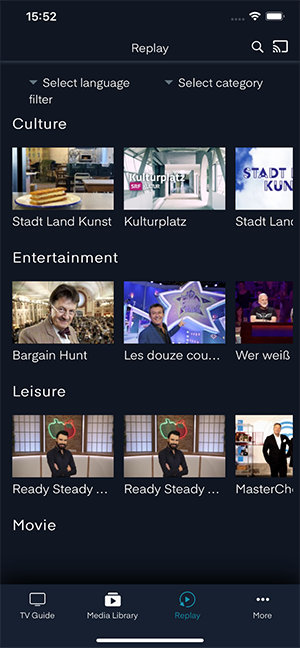
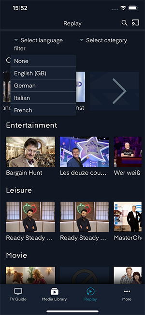
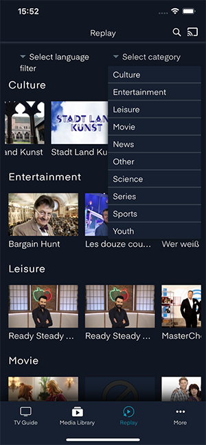
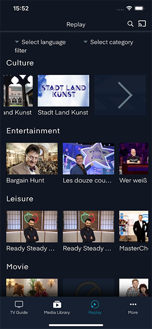
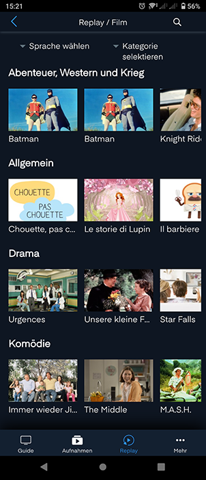
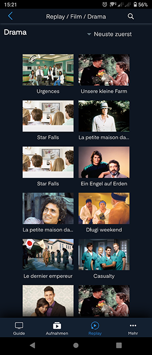
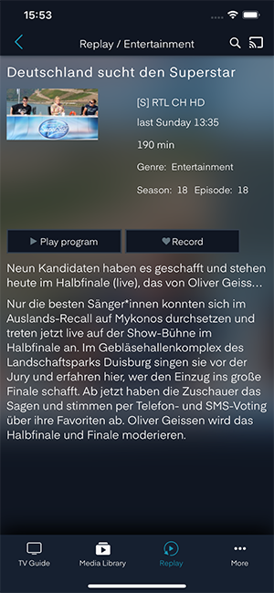
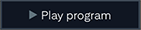
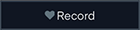

# Replay

Zeigt alle verpassten Sendungen an, die als Catch-up/Timeshift zur Verfügung stehen. Die verpassten Sendungen sind per Kategorien dargestellt.

## Filter

Oben gibt es zwei Möglichkeiten, die verpassten Sendungen zu filtern, per Sprache und per Kategorie.

### Sprachen

Sprachfilter setzen, gewünschte Sprache anklicken

### Kategorien

Kategoriefilter setzen, gewünschte Kategorie anklicken oder ...

wenn man durch alle verpassten Sendungen von einer Kategorie scrollt, gibt es die Möglichkeit, mehr Inhalte mit Subkategorien anzuzeigen, indem man auf den Pfeil klickt.

In der Darstellung der Subkategorien oben in der Mitte sehen Sie den Namen der Hauptkategorie. Sie können hier noch mal eine Kategorie tiefer mit dem «Kategorie Dropdown». Um in die übergeordnete Kategorie zu gelangen, klicken Sie oben links auf den «Zurück»-Button.

Hier gibt es nur noch die Möglichkeit zu sortieren und eine verpasste Sendung auszuwählen. Um in die übergeordnete Kategorie zu gelangen, klicken Sie oben links auf den «Zurück»-Button.

## Replay Info

Wählt man eine verpasste Sendung aus, werden die Details der verpassten Sendung dargestellt (Beschreibung, Channel, Dauer …). Die verpasste Sendung kann angeschaut  oder aufgenommen werden .