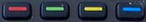
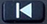
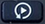
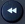
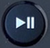
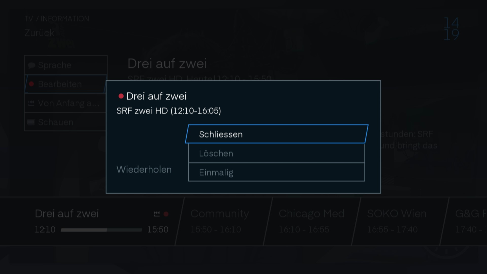
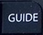
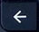
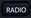

# TV

Hier finden Sie die Bedienungsanleitung zu Ihrer TV-Box.

## Start

Wenn Sie die TV-Box über den  Knopf anschalten, finden Sie sich Live in einer Sendung wieder.

## Fernbedienung

<svg xmlns="http://www.w3.org/2000/svg" xmlns:xlink="http://www.w3.org/1999/xlink" viewBox="0 0 88.82 303.23" width="300px">
    <defs>
        
    </defs>
    <g id="Ebene_2" data-name="Ebene 2">
        <image width="355" height="1212" transform="translate(0 0) scale(0.25)" xlink:href="../img/tv/fernbedienung.jpg"/>
    </g>
    <g id="Ebene_1" data-name="Ebene 1">
        <a href="../tv/#einschalttasten"><rect id="einausTVAux" class="cls-1" x="22.5" y="7.85" width="13.45" height="18.34"/></a>
        <a href="../tv/#farb-navigationstasten"><rect id="Farbnavigationstasten" class="cls-1" x="22.27" y="32.34" width="49.22" height="7.61"/></a>
        <a href="../tv/#einschalttasten"><rect id="einausSTB" class="cls-1" x="58.05" y="7.85" width="13.45" height="18.34"/></a>
        <a href=""><rect id="sourcewechsel" class="cls-1" x="38.8" y="14.96" width="10.09" height="10.09"/></a>
        <a href="../tv/#skip-und-replay"><rect id="zuruckspringen" class="cls-1" x="22.27" y="44.76" width="16.52" height="7.61"/></a>
        <a href="../tv/#skip-und-replay"><rect id="vorspringen" class="cls-1" x="55.22" y="44.76" width="16.28" height="7.61"/></a>
        <a href="../tv/#navigationsknopfe"><path id="pfeiltasten" class="cls-1" d="M116.34,86.36H97.92V98.93H82.52v16.43h15.4v12.58h18.42V115.36h15.41V98.93H116.34Zm-2.45,27.07H101.32V100.86h12.57Z" transform="translate(-60.59 3.12)"/></a>
        <a href="../tv/#navigationsknopfe"><rect id="home" class="cls-1" x="21.93" y="89.47" width="15.4" height="12.57"/></a>
        <a href="../tv/#navigationsknopfe"><rect id="guide" class="cls-1" x="55.75" y="89.47" width="15.4" height="12.57"/></a>
        <a href="../tv/#navigationsknopfe"><rect id="info" class="cls-1" x="55.75" y="118.48" width="15.4" height="12.57"/></a>
        <a href="../tv/#navigationsknopfe"><rect id="zurück" class="cls-1" x="21.93" y="118.48" width="15.4" height="12.57"/></a>
        <a href="../tv/#navigationsknopfe"><rect id="ok" class="cls-1" x="40.73" y="103.97" width="12.57" height="12.57"/></a>
        <a href="../tv/#navigationstasten-und-aufnahme"><rect id="startpause" class="cls-1" x="38.43" y="62.11" width="16.91" height="17.81"/></a>
        <a href="../tv/#navigationstasten-und-aufnahme"><rect id="stop" class="cls-1" x="23.35" y="71.62" width="12.57" height="12.57"/></a>
        <a href="../tv/#navigationstasten-und-aufnahme"><rect id="record" class="cls-1" x="58.49" y="71.62" width="12.57" height="12.57"/></a>
        <a href="../tv/#navigationstasten-und-aufnahme"><rect id="vorspullen" class="cls-1" x="58.49" y="57.52" width="12.57" height="12.57"/></a>
        <a href="../tv/#navigationstasten-und-aufnahme"><rect id="zurückspullen" class="cls-1" x="23.35" y="57.52" width="12.57" height="12.57"/></a>
        <a href="../tv/#skip-und-replay"><rect id="backtostart" class="cls-1" x="38.75" y="44.76" width="16.52" height="7.61"/></a>
        <a href="../tv/#lautstarke-und-zapp-tasten"><rect id="sprachnav" class="cls-1" x="39.84" y="137.32" width="14.24" height="15.06"/></a>
        <a href="../tv/#lautstarke-und-zapp-tasten"><rect id="mute" class="cls-1" x="40.67" y="154.25" width="12.57" height="6.73"/></a>
        <a href="../tv/#lautstarke-und-zapp-tasten"><rect id="ch" class="cls-1" x="57.26" y="136.61" width="13.89" height="25.97"/></a>
        <a href="../tv/#lautstarke-und-zapp-tasten"><rect id="vol" class="cls-1" x="22.69" y="136.61" width="13.89" height="25.97"/></a>
        <a href="../tv/#spezialtasten"><rect id="option" class="cls-1" x="22.02" y="210.35" width="15.77" height="7.77"/></a>
        <a href="../tv/#kanalauswahl-und-texteingabe"><polygon id="zahlentastatur" class="cls-1" points="22.02 167.19 22.02 199.53 37.79 199.53 37.79 207.29 55.38 207.29 55.38 199.53 71.15 199.53 71.15 167.19 22.02 167.19"/></a>
        <a href="../tv/#spezialtasten"><rect id="text" class="cls-1" x="22.02" y="199.53" width="15.77" height="7.77"/></a>
        <a href="../tv/#spezialtasten"><rect id="titles" class="cls-1" x="55.38" y="199.53" width="15.77" height="7.77"/></a>
        <a href="../tv/#spezialtasten"><rect id="radio" class="cls-1" x="55.38" y="210.35" width="15.77" height="7.77"/></a>
    </g>
</svg>

### Einschalttasten

Oben an der Fernbedienung finden Sie die Einschaltknöpfe.

Mit der Taste `TV/Aux` versetzen Sie den TV in den Stand-by-Modus. Mit dem  Knopf wird nur die Set-Top-Box in den Stand-by-Modus versetzt.

### Farb-Navigationstasten

Mit der  Taste gelangen Sie zu Teletext, mit den  Tasten können Sie durch den Teletext navigieren.

### Skip und Replay

Unter den Farb-Navigationstasten befinden sich rechts und links die  und  Tasten, mit denen Sie von Sendung zu Sendung springen können.

In der Mitte der beiden Tasten befindet sich die  Taste. Mit dieser gelangen Sie in die Replay-Bibliothek.

### Navigationstasten und Aufnahme

Mit den Tasten  und  spulen Sie vor und zurück. Drücken Sie die Tasten mehrmals, wird der Spulvorgang beschleunigt.

Mit der  Taste pausiert und startet das Programm.

Die Taste  bringt Sie aus dem Replay-Modus zurück zum Liveprogramm. Aufnahmen können so beendet werden.

Mit der  Taste nehmen Sie die gewünschte Sendung auf.

#### Aufnehmen

Klicken Sie während einer Aufnahme ein weiteres Mal auf die  Taste, erscheint die Aufnahmeeinstellung.

Mit `Schliessen` schliessen Sie das Aufnahmefenster wieder.

Mit `Löschen` beenden Sie die Aufnahme und das bisher Aufgenommene wird gelöscht.

Unter `Wiederholen` können Sie einstellen, ob Sie nur diese Sendung aufnehmen wollen oder ob jede Sendung der Serie aufgenommen werden soll.

### Navigationsknöpfe

Mit der  Taste gelangen Sie ins [Menu](./programm).

Mit der  Taste gelangen Sie zum [Guide](./programm/#guide_1).

Mit der  Taste gelangen Sie zur letzten geschauten Sendung oder in die oberen Ebenen der Einstellungen und des Guides.

Die  Taste zeigt Ihnen den Programmbanner an.

Mit den Pfeiltasten navigieren Sie in den verschiedenen Menüs. Um etwas auszuwählen, drücken Sie .

### Lautstärke und Zapp Tasten

Stellen Sie die Lautstärke mit den  Tasten. Wenn Sie den TV stumm schalten wollen, Drücken Sie . Ein erneutes Drücken stellt den TV wieder laut. Funktioniert auch über die oben genannte Lautstärke-Taste.

Die Tasten  ermöglichen das Zappen nach Programmliste.

Die  Taste wird für die Sprachsteuerung gebraucht. (Aktuell noch nicht verfügbar) 

### Kanalauswahl und Texteingabe

Mit diesen Tasten springen Sie direkt zum Sender Ihrer Wahl gemäss Programmliste.

### Spezialtasten

Die  Taste führt Sie zum Teletext.

Mit der  Taste stellen Sie die Sprache der Sendung und der Untertitel ein.

Gelangen Sie mit der  Taste direkt zu den Einstellungen.

Die  führt Sie zu den verschiedenen Radiosendern. Und vom Radio wieder zurück zu den TV-Sendern.