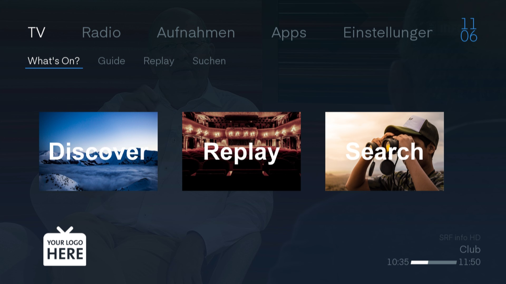

# TV Oberfläche

Wenn Sie Ihren TV einschalten, sehen Sie normalerweise den Sender, den Sie zuletzt geschaut haben.

## Infobanner

Klicken Sie auf  dann schauen Sie das Programm, das auf dem aktuellen Sender läuft. Ebenfalls sehen Sie, welche Sendung zu diesem Zeitpunkt läuft und welche Sendung im Anschluss folgt.

Mit den `rechts und links Tasten` können Sie im Programm des Senders hin- und herwechseln.

Mit den `rauf und runter Tasten` wechseln Sie den Sender.

Ein weiterer Klick auf die  Taste bringt Sie zur Sendungsinfo.

## Sendungsinfo

Die  Taste zeigt Ihnen Informationen zur Sendung auf.

### Infomenu

Die Sendungsinfo weist auf der linken Seite vier Knöpfe auf:

#### Sprache

Klicken Sie mit den Pfeiltasten auf `Sprache` navigieren und klicken Sie `Ok`, kommen Sie auf die Spracheinstellung des Senders.

> Mit der `Titles` Taste auf der Fernbedienung gelangen Sie direkt in dieses Menu.

Stellen Sie die Audiosprache und die Untertitel ein. Die verfügbaren Sprachen sind vom jeweiligen Sender abhängig.

> Allgemeine Sprachoptionen können in den ["Audio-Video" Einstellungen](../einstellungen/#audio-video) geändert werden.

#### Aufnahme

Klicken Sie `Aufnehmen` mit der OK-Taste nehmen Sie die gewünschte Sendung auf. Diese ist nach dem Ende in den `Aufnahmen` zu finden.

> Dies funktioniert auch mit dem  Knopf auf der Fernbedienung.

Klicken Sie OK, wenn die Funktion `Bearbeiten` verfügbar ist. Ein Fenster mit verschiedenen Optionen erscheint.

> Mit der  Taste gelangen Sie direkt in dieses Menu.

Klicken Sie die Funktion `Schliessen`, um das Fenster zu schliessen.

Mit `Löschen` unterbrechen Sie die Aufnahme und das bereits Aufgenommene wird gelöscht.

Unter `Wiederholen` entscheiden Sie, ob Sie nur eine einzelne Sendung oder die ganze Serie aufnehmen möchten.

#### Von Anfang an schauen

Mit dieser Schaltfläche kann man per OK an den Anfang der Sendung springen.

#### Schauen 

1. Zeile: Name der Sendung
2. Zeile: Sender mit Start- und Endzeit
3. Zeile: Kategorie
Lauftext gibt den Inhalt der Sendung in Kürze wider. 
Ist die Schaltfläche Verfügbar mit Replay  verfügbar, können Sie die Sendung von Anfang an schauen.

### Sendungsbeschrieb

Oben angefangen mit dem Namen der Sendung. Danach der Sender mit der Start- und Endzeit der Sendung. Darunter die Kategorie. Der lange Text ist der Beschrieb der Sendung. Wenn `Verfügbar mit Replay` zuunterst steht, kann man die Sendung zurückspulen.

### Senderbalken

Auf dem Senderbalken erkennen Sie, welche Sendung im Moment läuft und welche Sendungen folgen.

> Blenden Sie den Balkem mit einem Klick auf die `OK` Taste. Drücken Sie ein weiteres Mal die `OK` Taste, dann gelangen Sie zur Sendungsinfo.

## Home

Klicken Sie auf die  Taste, gelangen Sie zum Home Bildschirm. Von hier navigieren Sie zu den verschiedenen Funktionen.

